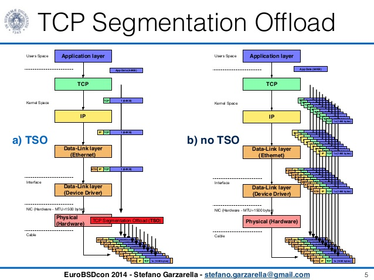

# 1. Introduction
TCP based workloads greatly benefit when segmentation/reassembly of TCP 
segments are done by the lower most layers like MAC layer or the NIC itself. 
In case of Tx, the application can send large sized TCP segments of up to 64K
to the TCP stack, which transparently passes them to the lowers layers of the
stack. The segmentation is generally done in the MAC layer, which adds the 
remaining headers like IP/TCP to each MSS sized payload and sends it to the 
NIC. In some cases NIC itself can do all these instead of the MAC layer. The 
overhead of header addition and packet processing for these smaller MSS sized
packets by all layers of TCP/IP stack is avoided and there-by boosts the 
performance. Likewise, for Rx, the NIC or MAC layer can assemble the smaller 
MSS sized segments and form a larger sized segment before handing it over to 
the IP layer there-by avoiding processing of headers at each layer of the 
networking stack.

Terminology wise, when the NIC does the segmentation, it is called TCP send 
offload (TSO)/TCP receive offload (TRO) and when segmentation is done in 
software, it is called Generic send offload (GSO)/Generic Receive offload (GRO)

In case of virtualized environments, offload further improves VMExits which 
result due to the avoidance of large number of packet exchanges between the 
host and guest.

# 2. Problem Statement
vRouter performs Tx and Rx TCP segmentation offload in the kernel mode currently. 
It largely leverages kernel APIs for achieving this. However, wrt DPDK, the 
library lacks segmentation support/APIs and hence DPDK based vRouter cannot do 
the offloads. For achieving line rate performance of TCP based workloads on 10G 
NIC’s, we need DPDK based vRouter to support offloads.

# 3. Proposed Solution
The proposed solution is illustrated in the diagram below except that the actual
segmentation is done in dpdk-vRouter instead of the NIC.

## 3.1 Alternatives considered
None
## 3.2 API schema changes
None
## 3.3 User workflow impact
None
## 3.4 UI changes
None
## 3.5 Notification impact
None
## 3.6 Block diagram

# 4. Implementation
## 4.1 Work-items for GSO

1.  The GSO feature needs to be advertised to the guest. This enables Tx 
offload by default in the guest.
2.  The vRouter lcore on the host which is listening on the guest''s virtio
ring dequeues the packet and gets information about the MSS.
3.  The vRouter lcore needs to construct a chained MBUF with each element 
in the chain having a size of MSS bytes and sends it to another lcore 
based on the hash using it is corresponding DPDK ring.
4.  The destination lcore needs to dequeue the packet from the dpdk ring 
and then add and adjust all the headers to each element in the chained mbuf. 
Basically it performs the GSO functionality.
5.  Need to support IPv4 and IPv6 headers formats.
6.  Need to support UDP and VxLAN encapsulations.

## 4.2 Work-items for GRO

1.  GRO feature needs mergeable buffers and the same needs to be implemented 
and advertised to the guest. The guest then can receive 64K sized packets.
2.  The core logic of GRO is an adaptation of Free-BSD LRO implementation.
3.  A per-core hash table needs to be implemented which stores the mbufs 
received from the fabric.  
4.  When a packet is received by an lcore, the core GRO logic needs to be 
implemented.
5.  Need to support IPv4 and IPv6 header formats
6.  Need to support UDP and VxLAN encapsulations

# 5. Performance and scaling impact
Coming soon..

# 6. Upgrade
Upgrade is seamless. No impact.

# 7. Deprecations
None

# 8. Dependencies
None

# 9. Testing
## 9.1 Unit tests
Coming soon..
## 9.2 Dev tests
Coming soon..
## 9.3 System tests
Coming soon..

# 10. Documentation Impact
None

# 11. References
Coming soon..
