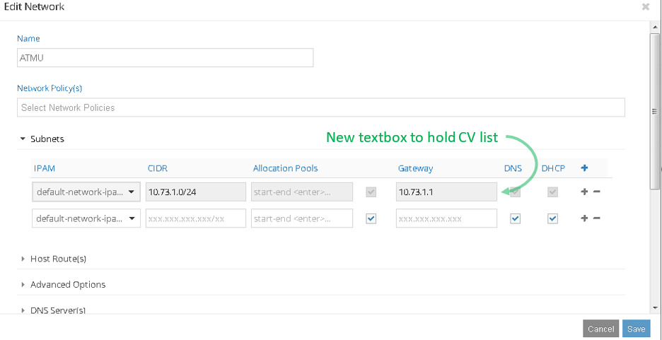

BGP Standard Communities
========================

#1. Introduction
Add support for user configured BGP standard communities for routes exported by
Open Contrail.

#2. Problem statement
BGP standard communities can be used for route steering and route preference
using RFC 1998 and other features. However, Currently Open Contrail supports BGP
standard communities only for static routes and not for other routes (like
interface routes), limiting the scope of RFC 1998 only to static routes.

#3. Proposed solution
Add support to allow user to configure BGP standard communities for host routes
exported by Open Contrail.
Similar to static routes, user will have a provision to configure BGP standard
communities as part of subnet in Virtual network configuration. Later any route
exported in this subnet will carry configured BGP communities along with the
route path.
Note: As part of this solution Open Contrail will not take any action
corresponding to these communities and it will only carry this information as
part of exported BGP route path

##3.1 Alternatives considered
None

##3.2 API schema changes
BGP standard communities will be added as a list under subnet in Virtual network
using the pre-defined 'CommunityAttributes' schema-type. 

##3.3 User workflow impact
No impact on existing workflow.
While Adding or Updating subnet configuration, user can add/modify/delete list
of associated community values to it, this will be accessible via VNC APIs or
Contrail UI

##3.4 UI changes
Subnets under network edit window will have additional text box to hold list of
user configured Community Values to it.

##3.5 Notification impact
No plan to add any log/UVE/alarms as of now, TBD.

#4. Implementation
##4.1 Work items
####Config Schema
BGP standard communities will be added as a list under subnet in Virtual network

####Control-node
None, control-node already has infra to encode and send community value
information as part of BGP route path.

####Vrouter-agent
Read the list of community values attached to the subnet, which will be
associated to any route exported from this subnet by contrail-vrouter-agent.

####Contrail-UI
Need to add additional text box to hold list of user configured Community Values
to Subnets under network edit window

#5. Performance and scaling impact
##5.1 API and control plane
No impact with feature disabled.
This feature does not have performance impact on API, extra encoded community
value will attribute to extra message buffer space. Control plane performance
will have marginal/no impact assuming limited list of associated community
values.

##5.2 Forwarding performance
No impact.

#6. Upgrade
No impact.

#7. Deprecations
None

#8. Dependencies
None

#9. Testing
##9.1 Unit tests
Unit Test cases will be added to validate newly added code

##9.2 Dev tests
Validation of user added community against propagation of community values to
BGP peering router

##9.3 System tests
Feature test to be done with a BGP peer MX/vMX

#10. Documentation Impact
A Wiki Page on OpenContrail github will be added with user information on how to
use this feature with required details

#11. References

