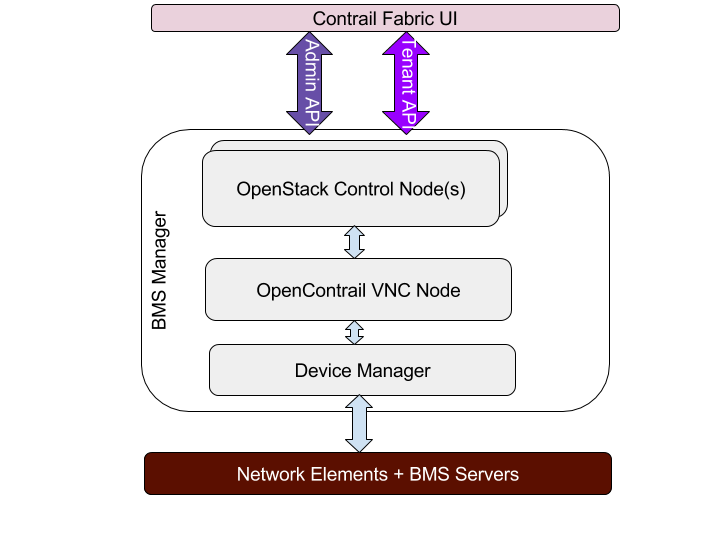
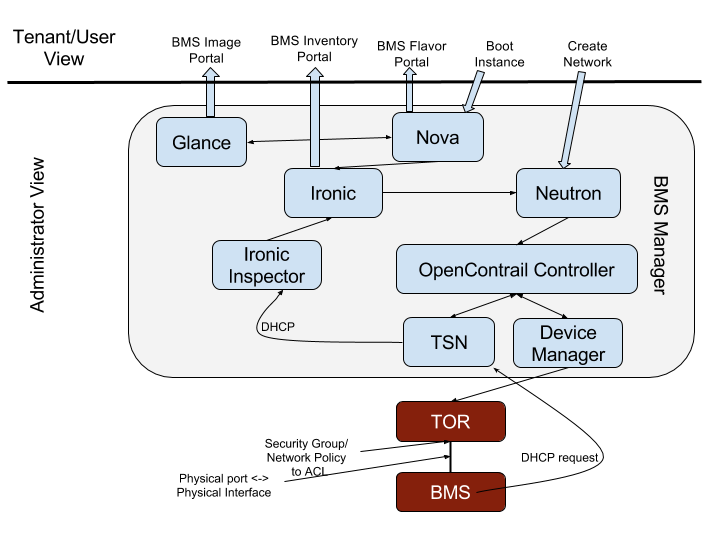

# 1. Introduction
Contrail BMS (Bare Metal Server) Manager manages the life cycle management of BMS, which includes booting tenant desired image, and attaches them to the tenant network in a Multi-tenant clouds. The goal is to provide single click solution for the tenants in a similar manner as they are used to managing the virtual machines in their cloud environments.

# 2. Problem statement
Contrail Fabric product aims at providing seamless connectivity between virtual machines spawned in a multi-tenant cloud environment and bare metal servers residing on the same tenent network. The solution ensures end-to-end programming of networking equipment within the IP fabric, virtual machines and BMSs to ensure seamless, desired connectivity between the end points. The BMS manager is required to manage the BMSs in the environment, along with VMs which are managed by multi-tenant clouds and networking equipment, which is managed by device manager module of the contrail fabric.

# 3. Proposed solution
## 3.1 Assumptions

1. BMS manager makes use of several openstack and modules to on-board the target BMSs. Hence availability of cluster running these needed components (also called under-lay network) is assumed.
2. The operating system images to be used to bring up target servers are built by administrator separately (outside the scope of BMS manager) using utility such as disk image create (provided by openstack).
3. The parameters for target servers such as MAC address, IPMI credentials, hardware information needs to be provided by the administrator. i.e. there is no discovery of target servers.
4. The provisioning/deployment of target servers will use ironic.
5. Administrator will take care of setting up routing between openstack, contrail nodes, MX, QFXs so that reachability between these different devices is available.
6. MX needs to be configured to allow traffic between ironic provisioning network and openstack node.
7. In phase 1, BMS manager will implement deployment of target servers as available in ironic. Additional provisioning of servers, such as creating static routes, creating users etc. may be considered for future release. 

## 3.2 High level Architecture
While multiple options were considered for the BMS Manager, this section discusses about the chosen architecture/design of the BMS Manager.  
The BMS Manager is built upon, and, exploits the full functionality offered by Ironic, Nova, Neutron, and Glance services of OpenStack. It will utilize OpenStack API internally. However, it will present a coherent northbound User Experience as is offered by the Contrail Fabric.
Figure 1 below gives the high level view of this architecture. In this case one or more of OpenStack control nodes are deployed depending upon the scale of cloud under management. One or more Contrail control nodes are deployed to manage the business logic of Contrail networking. The device manager is utilized to interact with the physical devices (Network elements as well Bare Metal nodes)
OpenStack control node(s) run critical OpenStack services which are utilized by the BMS Manager to offer northbound Administration as well tenant interfaces. The northbound APIs are utilized to provide various portals to the users/tenants. See the details in the detail design section below. The Contrail Control node(s) are used to implement the business logic for the BMS service and the business logic is then mapped to the Physical resources (Ports on the TORs) to provision the correct interfaces. 

BMS manager will make use of different modules such as ironic, glance etc from a fully provisioned contrail cluster with openstack. 

Hence as a first step, a contrail cluster with openstack will need to be deployed. Deployment of the contrail cluster is outside the scope of BMS manager.
Using user interface, administrator will provide parameters for the server or node to be added to the BMS available nodes. BMS will generate a new node and add it to available nodes database.
Administator can use BMS image APIs to add images to glance. The creation of image is outside the scope of BMS. Standard utility such as create build image can be used for this purpose by administrator.
Administrator will create flavors for the BMS systems using BMS flavor management APIs.
Once administrator has created the images, nodes and flavors, he will be able to deploy any of the available nodes with any of the added images and flavors.
BMS will monitor the state of deployed servers and provide this information to analytics using Sandesh.
All the nodes available with BMS manager will be in available or deployed state. Administrator can choose the un-provision a deployed server and move it to available nodes. It is also possible to delete an available node from the list of nodes managed by BMS manager. A deplyed server must be unprovisioned and made available before it can be deleted from BMS node list.

## 3.3 BMS manager offers the following functionality:
1. BMS Image management : Offers a catalogue of available bootable images available to the tenants to boot their Instances/BMS.
2. BMS Flavor management : Offers a catalogue of available flavors of the BMS available in the inventory. The flavors represent the capacity/class of the BMS, such as disk size, memory size, number of cores, etc. The flavor may include the manufacturer of BMS as well. The BMS manager creates pools of BMS based upon their capability/class, which is then exposed to the tenants via a catalogue
3. BMS Life Cycle Management - Life cycle management includes: 
   * Bringing Powered off Servers online in a secure manner. The boot up process is performed on a secure network to prevent snooping in a multi-tenant cloud. See more discussion about the security in the later sections.
   * Reclaiming the provisioned servers/instances after they are decommissioned by the tenants. The servers are properly cleaned on a secure network to prevent snooping during clean up process. The cleaning process ensures that the servers are left in virgin state so that it is ready to deploy with same (or different) image. 
4. BMS Inventory Management : maintains an Inventory of all the servers known to BMS Manager. This inventory includes the deployed instances/servers as well as available to deploy.
5. BMS IPAM management : While IPAM is managed by the Contrail controller, The BMS manager ensures that the IPAM for BMS servers is consistent with the virtual instances. It provides appropriate hooks to make sure the IP management is consistent between Virtual and Physical instances. 
6. BMS Network Security management : the boot cycle and/or cleaning of bare metal servers is extensive and lengthy process, which makes provisioning and cleaning phases susceptible for snooping by hackers in multi-tenant cloud environments. Hence, the BMS manager uses private networks for the provisioning and cleaning phases of the servers. Once, the server are ready for deployment, it puts the server in the tenant network. 
7. Tenant Network management : The BMS manager manages the plumbing and un-plumbing of bare metal servers to tenant and/or provisioning/cleaning networks - depending upon the deployment state of the server. 
8. BMS Discovery and on-boarding : The BMS manager supports both the discovery of new servers as well as on-boarding of the brownfield servers. This feature will be supported in the second phase of this project. Some on-boarding hooks via manual configuration may be provided in phase one. 

# 4. Implementation
##Detailed Design 
Figure 2 below describes various components involved in the design of BMS Manager. Here we describe only the critical services that are utilized in the design. 
The BMS Manager offers two roles/views; the tenant/user view and the Administrator view. The administrative role is utilized to configure/create certain critical data objects (described in details below) which are then offered to tenants/users for consumption. 
Following objects, offered by OpenStack, are utilized to populate the Contrail Fabric catalogue portal: 
* BMS Image catalogue - Glance Image service is utilized to publish this information
* BMS Inventory - Ironic Node objects are utilized to publish the Inventory
* BMS Connectivity - Ironic Port objects are utilized to publish the MAC addresses of bare metal servers as well their physical connectivity (to the TOR ports)
* BMS Flavor catalogue - Nova service is utilized to publish this information
Additionally, following Contrail data objects are utilized to achieve the business logic to offer BMS service: 
* Physical Interface - A Physical interface object represent one-to-one relationship to the physical TOR port where the bare metal connects to. 
* Logical Interface - A logical interface object is utilized to represent an interface in the Contrail business logic to represent a bare metal server. This object contains the Switch ID (the ID of the TOR), the port (physical port on the TOR where the server connects), and Switch Information (it contains the Physical interface ID). 
In order to render the services, a logical Interface is mapped to Physical Interface by matching the physical Interface ID. This mapping function allows for the migration of the bare metal servers without requiring any changes to the business logic. 

In order to offer the functionality described in the overview section, this design specifies two types of actions, namely the Admin actions and tenant actions.
The Admin actions are internal to the BMS Manager and required to correctly configure the BMS manager. The Tenant actions are taken by the users/tenants of the BMS service. 
### Administrative Actions
Following actions are required:
* Create two private networks under Admin scope. These are not visible to anybody but the Admin of the BMS Manager. One network is used for provisioning the servers during deploy phase and the second one is used for cleaning when the servers are getting decommissioned. These networks are essential to offer security against unwanted snooping by the hackers. From the Contrail networking point of view, these are normal virtual networks - except that they are created, and, are visible only in the admin role.
* Create the BMS images that are offered to the tenants via a catalogue. A special utility used in the OpenStack Ironic service (diskimage-builder) is utilized to create these images
* Register these images with Glance Service. These images then become visible to the northbound interfaces
* Based upon the classes or bare metal servers to be offered/managed, create baremetal flavors and register with Nova service. Multiple Baremetal flavors can be created (e.g. baremetal-huge, baremetal-large, baremetal-small, etc). These flavors are then mapped to the inventory of the available bare metal servers at the time of deployment. These flavors populate the Contrail Fabric portal to be consumed by the users/tenants
* Create Ironic nodes. A BMS server is represented as an Ironic node. The collection of the nodes constitutes the BMS inventory. In phase one, this is created manually (via script or Ironic Python API, which offers batch creation). Phase two will support auto-discovery of the nodes. 
* Create Ironic ports. These represent a NIC(s) in the bare metal servers. This includes the MAC address and the physical connectivity information. In phase one, this is created manually (via script). Phase two will support auto discovery of this. 

### Tenant/User Actions
Once the BMS service is instantiated, the tenants/users are offered a catalog of available services. They select the type of server they want to instantiate and the image they want to run. Here are two steps they execute:
* Create Tenant Network. Create a network if it is not already created.
* Select the BMS Image and BMS Image they want to instantiate and issue a boot command
Note that booting a bare metal server, from the user's point of view, is no different than the way they instantiate virtual server (machine) - except that they specify appropriate flavor type

### Flow of Control
As shown in figure 2, above, the BMS manager presents two views to the Control Fabric Manager, namely the Administrative view and tenant view. The Administrative view, as the name suggests, is strictly for the administration/configuration/management of the BMS Manager. 
The tenant view is made available to the tenants/end users. Even though end users communicate with the Control Fabrics UI, it is critical to separate these view beneath the UI.
The exact interaction and steps that get executed in response to user's request to launch a bare metal server are documented in details here.

## Data Model
The BMS Manager utilizes the Contrail data model with the following enhancement to port object's binding profile. 
Port profile is enhanced to include the physical connectivity of the BMS server into binding:profile as follows: 
{
   'local_link_information':[
       {
          'switch_info': 'Physical-Interface-UUID',
          'switch_id': 'aa:bb:cc:dd:ee:ff',
          'port_id': 'ge-0/0/1'
       }
   ],
}
The 'Physical-Interface-UUID' field in 'switch_info' field represents the UUID of the physical interface which is mapped to the physical port on the switch represented by port_id field. This physical interface is created by Device Manager as specified in item in Device Manager. The 'switch_id' represents the chassis mac address of the TOR where the BMS server is physically connected. Presently, contrail software does not use this field.

![VMI Mappings] (images/bms-design-vmi-mapping.png)
The business logic of VNC maps the Virtual Network (VN) of the BMS server to Logical Network. This logical network is then mapped to the physical interface described above and shown in the figure above. 
For LAG and MLAG configurations, multiple physical interfaces map to the logical interface as specified in LAG/MLAG/Port Groups support

### Underlay Networking Considerations
    Reachability to tftp boot server
    IPMI networking Consideration

### Security Groups/ Network Policy Support
    Simply map the Security Groups (and/or Network Policy)  rules to ACLs and and apply these ACLs to the physical port on the device where the BMS server physically connects to. See item 4 in Device Manager.

### LAG/MLAG/Port Groups support
In the real world production deployments, bare metal servers connect to multiple TORs for redundancy reasons (MLAG configurations). Also, depending upon the port bandwidth on the TOR and the NICs on the bare metal servers, multiple ports may be utilized to connect a bare metal server to the TOR (LAG configurations).
Note: LAG, bond, and Port Group interfaces are commonly used terms to represent bundled ports. LAG is from the TOR point of view and bond is from the server point of view. Port Group on the other hand is a logical view of bundled physical ports representing LAG on the TOR. 
Figure 4, below shows various physical connectivity configurations for the bare metal servers. All of these configurations will be supported in the BMS manager phase 2. Phase 1 will only support first configuration - i.e. the single port connectivity.
  
![TOR connections ] (images/bms-design-tor-connections.png)
The LAG/MLAG information is specified  by using additional data object called 'Port Group'. Port Group specifies the bond properties.
Port Group is represented as a collection/list of single ports in the binding profile of the port object as shown below (binding:profile): 
{
   'local_link_information':[
       {
          'switch_info': 'Physical-Interface-UUID',
          'switch_id': 'aa:bb:cc:dd:ee:ff',
          'port_id': 'xe-0/0/1'
       },
       {
          'switch_info': 'Physical-Interface-UUID',
          'switch_id': 'aa:bb:cc:dd:ee:ff',
          'port_id: 'xe-0/0/2'
       }
   ],
   'local_group_information': {
      'id': portgroup.uuid,
      'name': portgroup.name,
      'bond_mode': portgroup.mode,
      'bond_properties': {
         'bond_propertyA': 'valueA',
         'bond_propertyB': 'valueB',
       }
   }
}

Phase 1 of the BMS manager does not support either of these configurations. LAG and MLAG configurations will be supported in phase 2

### On-boarding of BMS Servers
Onboarding of two type of bare metal servers deployments is supported into the BMS Manager (and Contrail Fabric), namely the Greenfield deployments and Brownfield deployments. 
Greenfield deployments are the bare metal servers which has not be deployed and are required to be managed by the BMS Manager. These are racks of dark servers which may or may not have any image installed on them. These servers have no IP address assigned to them. See Auto Discovery section below regarding the discovery of these servers. 
Brownfield deployments are the bare metal servers which has been deployed, are in active use by the tenants and their management is needed to be transitioned under the BMS Server (Fabric Manager). These servers have IP addresses already assigned to them

Greenfield deployments will be supported in phase 1 and Brownfield deployments will be supported in future phases (phase 2 or beyond) 

### (Auto) Discovery On-boarding of BMS Servers
All bare metal servers that need to be managed by the BMS Manager needs to be onboarded. The onboarding can be done by automatically discovering the servers or manually registering the servers. 
#### Manual Discovery
Manual discovery is performed by registering all bare metal servers, their mac addresses and their physical connectivity manually. This step is described in Administrative Actions.
#### Auto Discovery 
Auto Discovery of all servers can be achieved by utilizing the Ironic Inspector and DHCP framework. When a server is powered on and physically connected to the TOR device, the DHCP frames are utilized to discover the mac address as well as the connectivity information. 
Ironic Inspector uses the mac address to match the existing inventory. If a match is not found, an implicit registration of the server is performed, which is referred to as auto discovery. 
Note: Phase 1 of the BMS Manager will support only Manual discover. Auto Discovery will be supported in phase 2 

### BMS Migration
BMS Migration, unlike VM Migration is handled differently. In the world of BMS, the BMS migration refers to: 
1. Migrating workloads from one server to another in same or different rack - this is type of migration is left to the users and BMS manager is not involved or offers any support - other than the analytical data. See Analytics/ Monitoring Support.
2. Moving of the server from one rack to another or moving the server from one port of the TOR to another port of the same or different TOR
The BMS Manager supports the second type of migration. However, this migration is not live and is disruptive. Tenant is required to shutdown the server, move to new home, and then boot it.

### Analytics/ Monitoring Support
The BMS Manager can provide two types of monitoring: 
1. BMS Life Cycle Events - these are Ironic logs during the LCM of the servers. At this moment, this is an investigative item. If TCP streaming of syslog is not supported in Ironic upstream, we may have to develop this feature and submit to the Ironic community. 
2. Post BMS/Host health events - this requires either a new health monitoring agent to be installed by the admins/user. We may offer Appformix as an option
Item 2 above is post phase 1 (or even phase 2). 
Subject to the finding of investigation, item 1 may or may not be part of phase 1

# 5. Performance and scaling impact

## 5.1 API and control plane
None

## 5.2 Forwarding performance

# 6. Upgrade

# 7. Deprecations
None

# 8. Dependencies

# 9. Debugging

# 10. Testing
## 10.1 Unit tests
## 10.2 Dev tests
## 10.3 System tests

# 11. Documentation Impact
