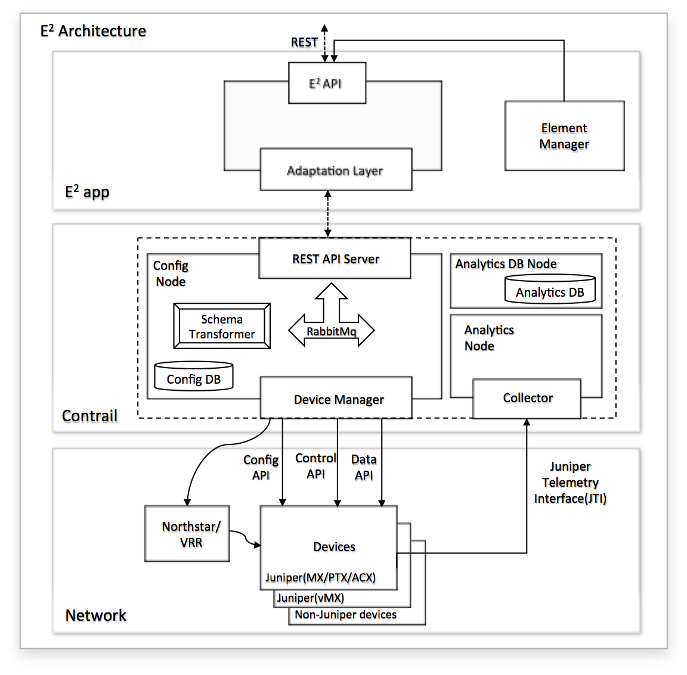

# 1. Introduction
The Elastic Edge - Virtual Route Server (E2 VRS) is Juniper’s first offering
of a programmable Route Server to the Internet Exchange community. E2 VRS is 
an intent driven SDN controller that instantiates public peering services at 
an Internet Exchange Point. VRS is one of the applications in the E2 suite 
of SDN controllers that provide service abstraction by translating high-level 
user-defined abstract data models, into low-level device configuration.

# 2. Functionality
With the rise of SDNs and Intent Based Networking, network operators want 
to specify what they want to do instead of describing how it is to be done. 
E2 is an SDN Controller that instantiates network service instances across 
nodes of a network, whether physical or virtual.  E2 leverages intent-based 
service models to describe the resulting network service instances. E2 
Virtual Route Server brings intent based network services into the Internet 
Exchange Point (IXP) networks, which were traditionally managed by open 
source route servers.

In a typical IXP network, there are several clients and there is a route-
server; the route server establishes external BGP sessions with the clients’
peering routers. To implement a peering service, the route server needs to 
be configured with elaborate BGP policies, which define how to distribute 
routes between clients. These policies can be complex and tedious to 
configure manually, and error prone when many clients are peering with the 
route server.

E2 VRS solves this problem by simplifying and automating the route server 
configuration. E2 VRS provides Peerbook as the user-interface to manage the 
system. Using Peerbook, the IXP operator can express the peering intent using 
a simple intuitive model and leave the onus and complexity of configuring the 
clients and BGP policies to the VRS system.

## 2.1 Peerbook
Peerbook provides the interface into the E2 VRS system. Using Peerbook, the 
IXP operator can express the intent to establish peering service between the 
IXP clients using a simple data model. This data-model serves as a single source 
of truth, and abstracts the operator from the low-level route-server 
configuration details.

The intended user of Peerbook is the IXP operator. In the future, we may extend 
it to allow IXP members to onboard themselves and initiate peering requests with 
other members. In this section, we will introduce the Peerbook constructs at a 
high-level.

### 2.1.1 Peerbook Client
Within Peerbook, a Client represents a service-provider domain or a member 
at the IXP. Each client may have one or more member routers or Peers. Each Peer 
is an Autonomous System Boundary Router (ASBR) that is connected to the IXP 
network, and runs external-BGP to exchange routing information from the client 
to the VRS and vice-versa.

A client domain may consist of a single or multiple Autonomous systems (AS). 
Within each AS, there can be one or more Peers.

The Client is identified by a name of the organization and is a logical grouping 
of all Peers of that client. Each Peer is defined by properties, which include 
IP-address, AS-number, and some optional characteristics. 
This can be represented using the following object model.

### 2.1.2 Peerbook Connection
A Peerbook Connection represents a peering intent, and connects two Clients. 
When two clients are connected in Peerbook, the VRS system automatically does 
several operations that lead to the clients exchanging routing information with 
each other, such as:

1. Establish external-BGP sessions with each Peer
2. Generate and configure extensive policies using BGP communities
3. Apply policies to the routing-instance import/export attachment point
4. Import and evaluate routes from each Peer
5. Apply rib-group policy to copy routes between local-RIBs
6. Evaluate and export routes to each Peer

In the scope of this feature, the connection represents a public-peering policy. 
This could evolve into more complex policy objects when E2 VRS is extended to 
use-cases beyond IXP deployments.

### 2.1.3 Peerbook Workflows
The Peerbook workflow consists of the following basic steps:
1. Pre-staging the VRS system (E2 VRS application and VRR pre-staging)
2. Adding a client (Define a client with a list of Peers)
3. Connecting two clients for public-peering

In addition, Peerbook also supports these additional workflows:
1. Updating a client (add Peers, delete Peers, update Peers)
2. Deleting a client (deletes the client and its connections)
3. Disconnecting two clients

For operations and management, Peerbook supports the following:
1. Client status
2. Peer status
3. Number of prefix imported from a client
4. Number of prefixes exported to a client

# 3. E2 VRS Architecture
Within the E2 VRS system is the E2 app, the Contrail system and the network 
where the JUNOS VRR is running as a VM. The VRR is an enhanced version of 
JUNOS RPD with special code that enables it to function as a route server. 

The VRR establishes BGP sessions with the Clients’ Peer routers and populates 
its local RIB with the routes from the Peers. When 2 clients peer using the 
VRS system, the VRR facilitates route exchange between the clients, by 
using IXP standard BGP policies that identify well-known client tagged 
prefixes.

The E2 App, together with the Contrail subsystem, provides the service 
abstraction by translating high-level user intent, into low-level VRR 
configuration. Note that the VRS system only configures the VRR, and not 
the Clients’ Peer routers. This is the convention in IX networks, where 
the operator configures the route server and the clients/service-providers 
configure their member routers, thus having full control over their network 
prefixes, how to tag them, what prefixes they want to advertise to the route 
server, and what prefixes they want to import from the route server.

The Peering Intent data model specified by the user is stored and represented 
at various layers in the E2 VRS system, including the E2 App and E2 Contrail. 
The Contrail system has VRS extensions to translate peering intent into route 
server configurations and pushes this configuration to the VRR.

# 4. Problem Statement
Design and implement a high level user model for public-peering and low-level
technology model to configure the Junos VRR as a route-server through Contrail.

# 5. Proposed Solution
The following is the data model for Internet Peering.

## 5.1 Alternatives considered
Implement Route Server without Contrail.

## 5.2 API schema changes
Current API schema is not affected. E2 VRS is added as an additional application
to the E2 suite. New ojects are defined to represent a client and peering-policy.

## 5.3 User workflow impact
None.

## 5.4 UI changes
E2 VRS has its own UI and does not use Contrail UI.

## 5.5 Notification impact
None

# 6. Implementation
The following Contrail modules are enchanced to support E2 VRS.

1. Contrail API schema
2. Contrail device-manager

## 6.1 Work-items for Contrail API

1.  Define a new data model for Internet Peering via a route-server

## 6.2 Work-items for Contrail device manager

1.  Add device-manager objects corresponding to user model objects
2.  Add configuration for peering

# 7. Performance and scaling impact
E2 VRS needs to support a few thousand clients at-most. The known
upper limit is around 800 clients.

Performance of a single contrail controller should process 80-100
API requests/second.

# 8. Upgrade
Upgrade is seamless,no impact. Below is the layout of Contrail:E2 package

# 9. Deprecations
None

# 10. Dependencies
None

# 11. Testing
## 11.1 Unit tests
1. Unit test for schema changes goes into the contrail test code
2. Same applies for device manager changes.
## 11.2 Dev tests
dev-test will follow the similar mechanism as contrail team to test Contrail:E2
## 11.3 System tests
Yet to be added.

# 12. Documentation Impact
None

# 13. References
1. http://www.juniper.net/us/en/local/pdf/whitepapers/2000535-en.pdf
2. https://github.com/Juniper/contrail-controller
