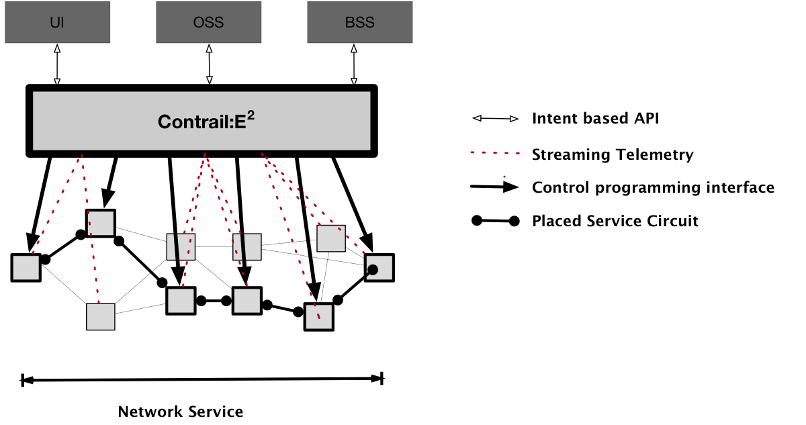
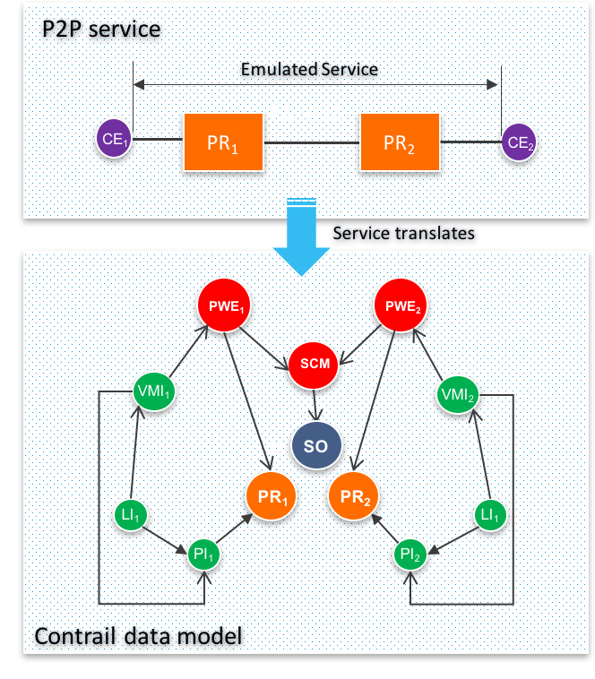
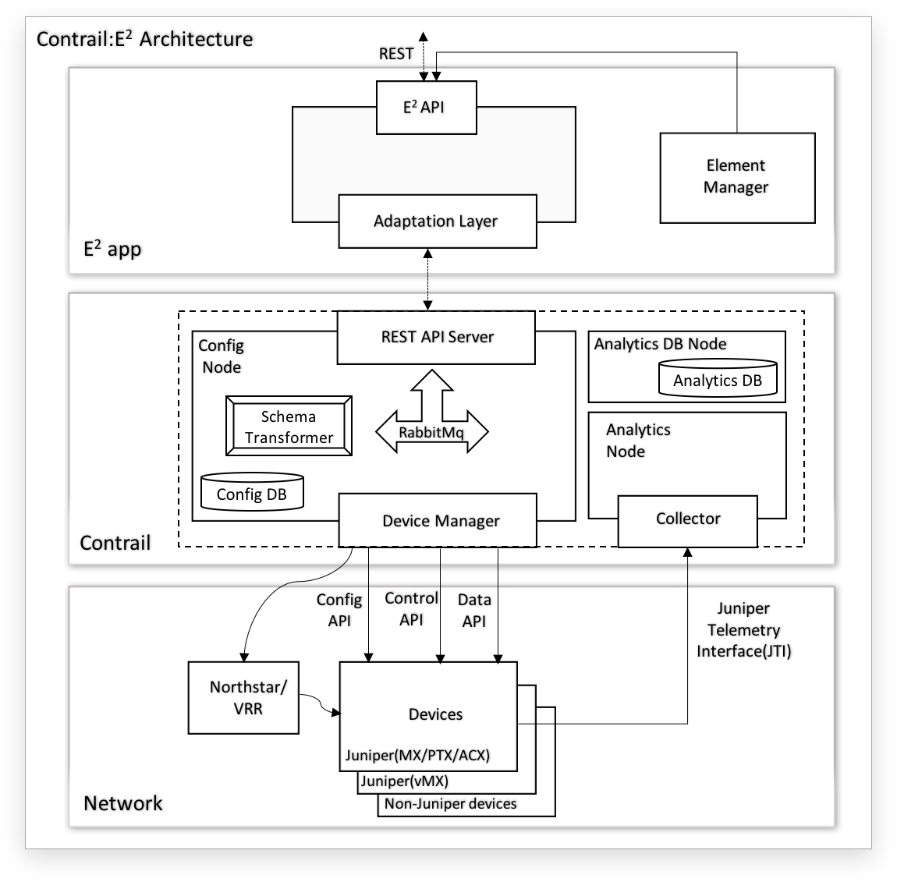
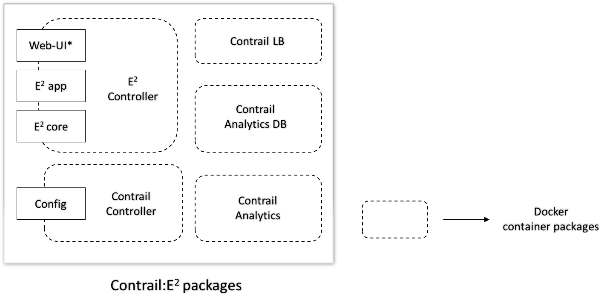

# 1. Introduction
Contrail:E2 is a scalable and highly available service provisoning SDN
controller that places network service instances across different nodes
of a network, whether physical or virtual.

A continuous stream processing data from the network contributes to the
engine placing the input “intent” – a high-level description of a network
service request. Such request will result in a decision on where it should be
orchestrated, based on the request types, available resources and network
status. The intent is then transferred to the network elements using a
combination of configuration and control APIs exposed by the network devices.
Changes to the configuration are made using industry standard Netconf protocol,
changes to the control plane via RPCs, and changes to the data plane via
forwarding APIs provided by the device (e.g Juniper’s API is called AFI:
Advanced Forwarding Interface).

The engine gets a wide variety of real-time feeds of telemetry data, including
topology, bandwidths, latencies, flow captures, routing information, and
application and user metrics. Telemetry data streamed from the devices is
utilized to make placement decisions in order to ensure optimal utilization
of network nodes and guarantee the required SLAs.  The system will also provide
lifecycle event hooks for the orchestration so that the user can customize the
workflow in the way they deem appropriate.

# 2. Problem Statement
Support service provisoning high level data model and low level technology
configuration in Contrail.

# 3. Proposed Solution
The data model for this new controller is shown in below picture.

## 3.1 Alternatives considered
Implement SDN without Contrail support
## 3.2 API schema changes
Current API schema is unaffected, except few attributes were added to
physicalRouter, physicalInterface and VirtualNetwork.
Rest of the schema objects are new and applicable to provisioning SDN,
as shown in section 3.

The flavors like P2L, and MP2MP will be covered later. For now, the focus is on
P2P model.

## 3.3 User workflow impact
None at this moment
## 3.4 UI changes
None as Contrail:E2 uses it's own UI, instead of Contrail UI.
## 3.5 Notification impact
None
## 3.6 Block diagram

# 4. Implementation
Only two modules in contrail are affected by Contrail:E2

1. Contrail API schema
2. Contrail device-manager

## 4.1 Work-items for Contrail API

1.  Define new data model for service provisioning use case
2.  Define new UVE types for fetching
     - Network configuration
     - Service status

## 4.2 Work-items for Contrail device manager

1.  Add low level configuration support for contrail:E2 services
2.  Add multi-vendor support(specifically Nokia)
3.  Add service-status and network configuration UVEs

# 5. Performance and scaling impact
Contrail:E2 needs support for managing upto 4000 network devices.
Performance of a single contrail controller should process 80-100
API requests/second.

# 6. Upgrade
Upgrade is seamless,no impact. Below is the layout of Contrail:E2 package

# 7. Deprecations
None

# 8. Dependencies
1. Support from Contrail config node manager team.

# 9. Testing
## 9.1 Unit tests
1. Unit test for schema changes goes into the contrail test code
2. Same applies for device manager changes.
## 9.2 Dev tests
dev-test will follow the similar mechanism as contrail team to test Contrail:E2
## 9.3 System tests
Yet to be added.

# 10. Documentation Impact
None

# 11. References
1. http://www.juniper.net/us/en/local/pdf/whitepapers/2000535-en.pdf
2. https://github.com/Juniper/contrail-controller
