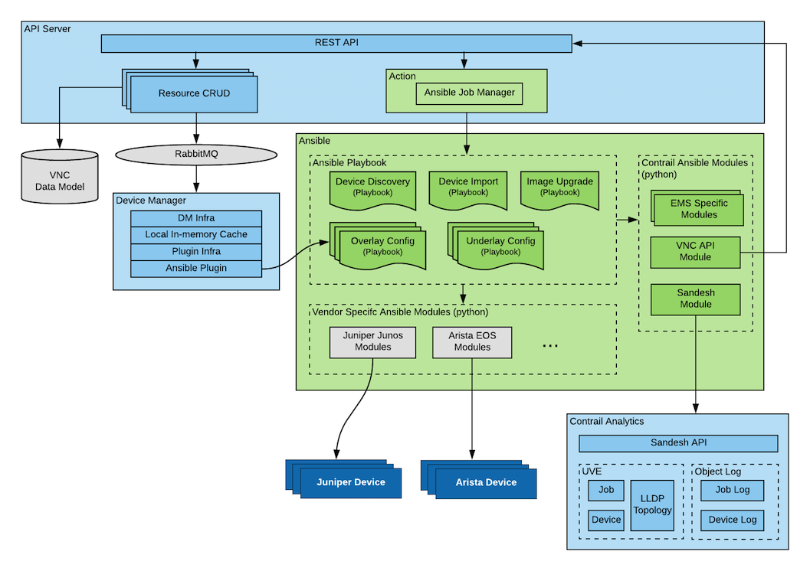
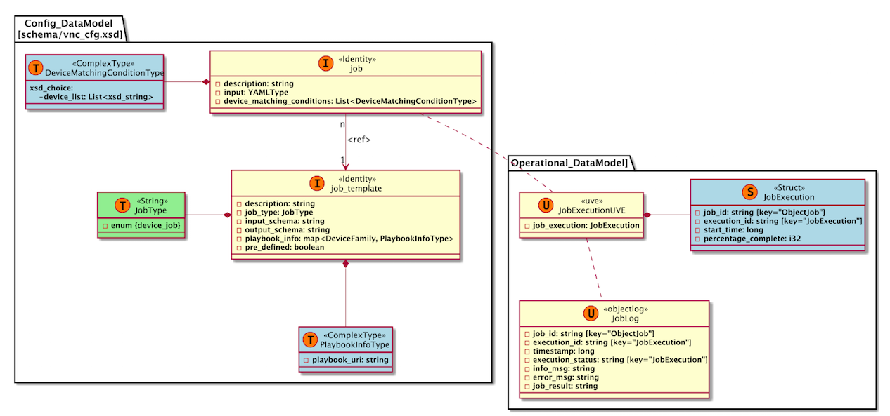
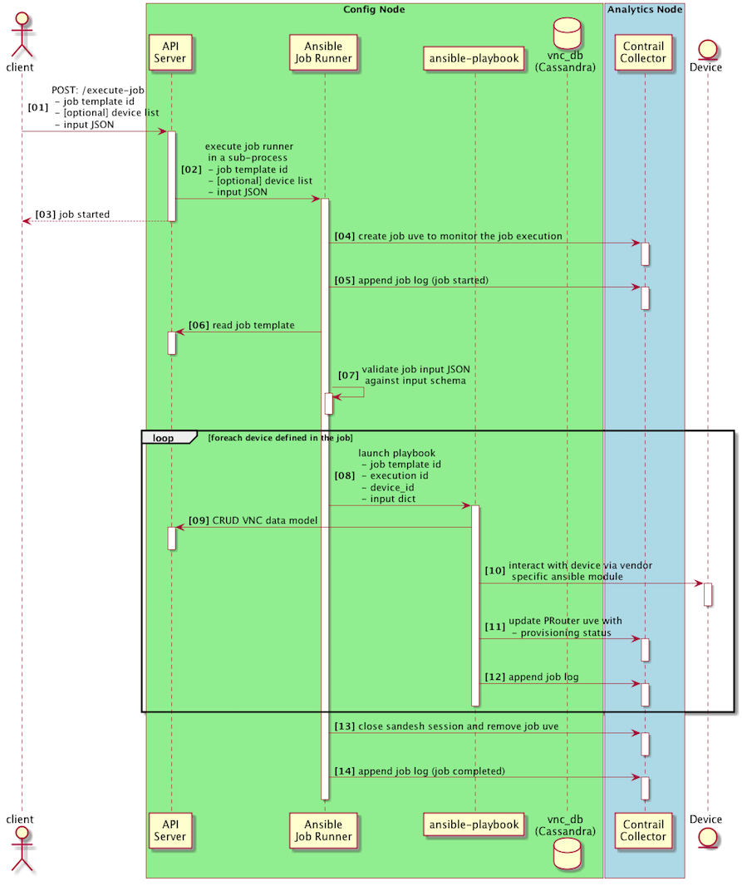
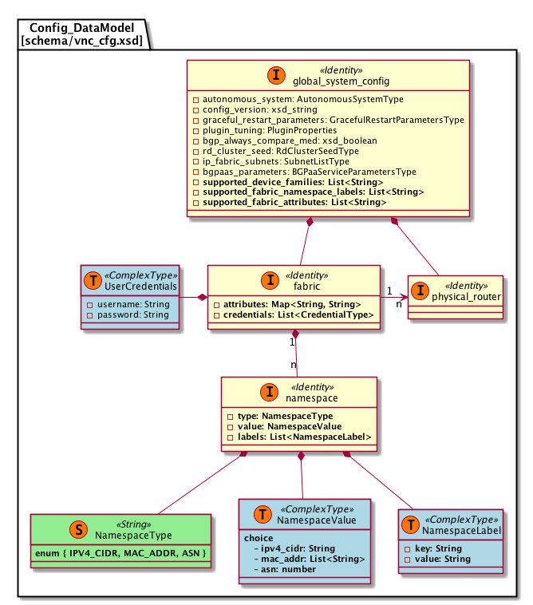
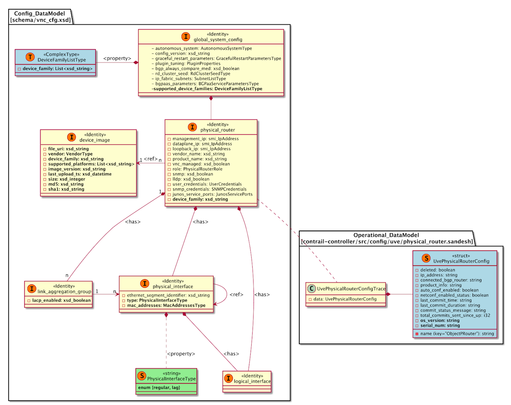

# 1. Introduction
Contrail Fabric management use cases require management and automation of the underlay networks in the data center. This spec covers the design and implementation of extending existing Contrail config node to provide EMS capabilities on physical network elements, such as TOR/EOR switches, Spines, SDN gateway, and VPN gateways in the data center. User should be able to perform basic device management functions such device discovery, inventory import, image management, device image upgrade, etc. 

# 2. Problem statement
Contrail currently does not manage the underlay network in the data center and it assumes the underlay network is provisioned prior to the overlay network provisioning via Contrail. There is no automation of the underlay network provisioning and management. Because the underlay network is managed outside Contrail, admin needs to manually populate the Contrail VNC data model with underlay network info via UI or API. This process could be automated when the underlay network is managed by Contrail.

Many underlay network is built with devices from multiple vendors. One of the challenge to underlay network management is multi-vendor support. Each vendor's device has its own CLI commands, configuration schema, or APIs to configure and operate. 

Here are the user stories that captures the requirements from PLM for underlay network onboarding and automation.

#### [User Stroy GLAC-44] - DC Admin managing Fabrics and their namespaces and attributes to define the Fabric attributes to be used
This User Story refers to a user willing to manage a set of devices and BMS/PNF as a Fabric; a fabric is a set of devices and BMS/PNFs that falls under the same DC admin responsibility area. Therefore, in advance to managing devices and BMS , the user wants to define the Fabric namespaces (IP addresses, Route targets,etc/..) and attributes that will be assigned to the devices and BMS/PNF to onboard them on the Fabric
All devices and BMS/PNFs are assigned addresses and names from the same namespace
These devices and BMS/PNFs may be in different sites, however they are managed and administered through the same Contrail Fabric instance

The User Story aims to specify the User experience requirements for the user to be able to define

- Namespaces and Fabric Attributes Of the set of devices that Contrail Fabric will administer as a single administrative domain
- The user is able to see through the UI all its administered Fabrics. Each fabric is an independently administered domain. Each Fabric may be linked to a different RBAC profile for administration (managing the fabric) as well for services
- The User is able to specify overlapping or non overlapping namespaces across distinct fabrics. Fabrics are independent tenants

At a minimum, a Fabric is defined through a set of Namespaces: addressing and naming spaces for all entities Contrail Fabric has to provision for that fabric to be ready-for-service and to implement service overlays Attributes: topology characteristics and characterization of the fabric

#### [User Story GLAC-48] - View Existing Fabrics
As an admin, I want to be able to see all my existing fabrics so that I can make changes to them or view details of each of these fabrics.

#### [User Story GLAC-49] - Create Fabric, namespaces and attributes
As an admin, I want to create a new fabric so that I can onboard devices, PNFs and BMS on the fabric.

#### [User Story GLAC-51] - Discover device by management ip 
As an admin, I should be able to discover brownfield devices by supplying the management ip and credentials so that I can add this device to my fabric. 

The user enters the namespace definition first via the UI, this information includes a list of IP addresses, or a range, or a subnet, along with an optional mac address as well, and a set of credentials. This information is stored in the database and is entered from the UI. 

Then, the user will launch the device on boarding job. 

The inputs into the discovery can be: 

1. IP Address range 
2. IP Subnet 
3. Several user-ids/passwords 
4. password based for phase 1, NOT key-based. 

The discovery should try each IP address, if it's pingable, then try the different user-ids/password combinations until one of them works. If none work, continue with another IP address in the subnet and/or range. 

#### [User Story GLAC-110] - Perform software upgrade on selected devices
As a DC operator, the user must be able from the Contrail Fabric UI to 
1) select a set of devices by group,type,vendor/model and/or OS version 
2) apply a polocy that performs SW upgrade on the selected devices to a target OS version. 

Acceptance criteria: All selected devices are software upgraded to the target OS image selected

#### [User Story GLAC-47] - Device Onboarding - brown field
The user wants to onboard a Brownfield device in Contrail Fabric Onboarding the device means to change its status to Ready-For-Service, which means the device can be used to perform CRUDL operations on Overlay services 

Initial condition: The device is present in the Device Inventory where it must have at least Mgmt IP @ assigned (& associated mgmt MAC), Vendor:type:OS, Fabric name assigned, GroupID assigned 

The device has already management address, base configuration active. It also has IGP protocols , routing policies configured. However it may not have role-specific fabric configuration 


#### [User Story GLAC-136] - Device Topology Discovery
After a device has been on-boarded, and is managed by Contrail Fabric a topology discovery process should be initiated. 

If LLDP is not configured on all ports on the device it should be added to facilitate auto-discovery. 

The topology discovery should discover and correlate the LLDP neighbors and connected ports. The discovery should determine which devices are connected, and on which ports they interconnect. 

The information should be stored, to facilitate future Topology Visualization, and allow for the automatic configuration of Point-to-Point Interfaces and their associated underlay routing protocols. 

Where dynamic topology discovery is not desired or supported the user should have the ability to create an association between two discovered objects, manually defining the adjacency. 

# 3. Proposed solution
The proposed solution is to extend Contrail config node with EMS functionality via Ansible. Device discovery, device image upgrade, device underlay configuration are implemented as Ansible playbooks that are triggered via a new action URL added to the API server. A set of custom Ansible python modules are developed for EMS specific logic as well as interactions with VNC data model and uve/object log operational data model. Diagram below shows the proposed architecture.



### Why Ansible?
- Multi vendor support with rich plugin
- Extensible configuration management and automation with rich set of plugins 
- Easy to customize by network engineer during deployment

### Why job?
- Some EMS functions such as image upgrade or RMA could take long time to execute and user needs feedback on the progress
- Many EMS functions are applied to multiple devices in a workflow. It is important for admin to keep track of devices with failures.
- There are use cases where EMS functions needs to be scheduled to run at certain time window.

### Job Template

Job template is a new identity added to the VNC data model to capture the metadata info for an Ansible playbook. New playbook and Job template can added to the system on the fly and existing playbook and template can be tweaked and customized by the field engineer. However, the following job templates are loaded into the system during initial installation of Contrail Fabric:
- job template for device discovery
- job template for device import
- job template for image upgrade
- job template for limited underlay config

A job can be launched via action URL "/execute-job" against a job template. The payload of this action URL contains the following info. Examples can be found in section 4.6.
- job template id
- optional list of PRouter device id. When this parameter is set, the playbook will be run in parallel against multiple devices.
- job input JSON which contains the specific input for this job. The JSON must conform to the JSON schema specified job template's "input-schema" property

The "/execute-job" action launches the job in a sub-process and returns to the caller before the job execution finishes. JobExecutionUVE object is created to track a specific job execution. The life span of this UVE object equals to the life span fo this sub-process. While job is running, a job log is also created to record the job execution progress. The job status attribute of last job log should be either success or failure. Last job log entry should also include the job result if the job completes with success.
 


### Ansible Playbook Execution Flow


## 3.1 Alternatives considered
#### NA

## 3.2 API schema changes
### 3.2.1 Fabric Management
Two new identity objects are added to the Contrail VNC data model: _fabric_ and _namespace_

_Fabric_ defines a set of namespaces and attributes for a set of devices that belongs to the same administrative domain. Each fabric has a list of namespaces objects, a list of key-value attributes, and a set of device credentials. In phase 1, we support three types of namespace: IPV4 CIDR addresses, ASN numbers, and MAC addresses. Each namespace can be tagged with one or more labels. Each label is a key-value pair similar to [Kubernetes label](https://kubernetes.io/docs/concepts/overview/working-with-objects/labels/). Here is an example of a namespace:
```
type: ipv4_cidr
value: 10.155.69.0/24
labels: [{"management": "spine"}, {"loopback": "spine"} ] 
```
Labels are used by the device management playbooks to select the appropriate resources defined in the namespace to onboard, manage, and configure the devices in the fabric. For example, the device discovery playbook used the `management` label to find the namespace that contains the management IPs for the fabric devices. 

Fabric attributes are the key-value labels for the _fabric_ object. It could be used as directives, or hints to assign resources defined in the namespace to devices. For example, `igp-protocol: ospf` attribute could be used by the underlay provisioning playbook to choose which IGP protocol to use for the IP fabric.

Each _fabric_ object is associated with a set of PRouter devices that belongs to the fabric. The ref edge is added between _fabric_ object and _physical-router_ object in the data model. Each PRouter device can only be associated with one _fabric_ object.
  

### 3.2.2 Device and Image Management
#### device-image 
This is a new identity object added to the VNC data model to capture all the metadata for the device image. When device image object is assigned to the physical-router, the intent is to upgrade the physical-router to the specific software version specified in the device image object. When the image upgrade is successfully performed, the UvePhysicalRouterConfigTrace UVE's os_version attribute should match the one defined in the device image. Here are the list of properties for the device image object:

#### link-aggregation-group

#### Updated VNC identities:
global-system-config, physical-router, physical-interface, logical-interface, 

#### Updated UVEs:
UvePhysicalRouterConfigTrace



## 3.3 User workflow impact
Here is the high level workflow for the phase 1
1. Admin creates a new Fabric object in Fabric landing page
    - defines namespaces for management IP prefix and ASN number
    - defines fabric attributes such as credentials and directives for BGP underlay config.
2. Admin selects the newly created Fabric object in the Fabric landing page and launches the device discovery job. The detail fabric page will show the job execution status & log. When the job is done, the network device page of the fabric will be populated with discovered devices.
3. Admin selects one or multiple newly discovered device in the device landing page and launch the device import job to import physical/logical interfaces.
4. Admin select one or multiple devices in the device landing page and launch the image upgrade job
5. Admin select one or multiple devices in the device landing page to deploy the underlay config.

When we support the device roles and onboarding policy in Phase 2, The step 3, 4, 5 will be triggered automatically by the policy when device is assigned with proper roles.

## 3.4 UI changes
#### Introduction
For Phase 1, the goal is to seamlessly integrate the new functionality required by the UI, into the new Contrail UI. There are several new areas or UI screens that need to be added as follows:

###### Fabric Page
A new section where the user can create a new "fabric" and specify one or more "namespaces" is required. The left navigation can be extended by adding a new section called __Fabric__. Once selected, a statistical 
landing page will be displayed, with information about the various fabrics and devices (details TBD). A list of existing fabrics will be displayed, along with an __Add__ button to add a new fabric. 
Once a fabric has been selected, the user can then do the following:
- create a new namespace
- edit an existing namespace with the caveat that deletion is not permitted and needs to be handled elsewhere.
- Once a namespace is created, the user has the option to run a __Discovery__ on that namespace.
- Discovery needs to be idempotent


###### Devices Page
Under the devices page, two new columns need to be added; __state__ and __role__. The __states__ indicates the state that the device is in:

- `Probing` - this state is set when a ping/snmp has determined that it is a device of some sort, but before the credentials have been tried.
- `Credentials Failed` - this state indicates that none of the credentials worked. Here the user may go back to the fabric page and add an additional credential
to one of the namespaces.
- `Under Config Pending` - this state indicates that the device is under fabric management, but the underlay hasn't been configured
- `Under Management` - the underlay has been configured and the device is under fully under management and can now be used by the overlay.
- _please note the above states are not final._

The _role_ specifies whether that device is a _spine_ or a _leaf_ and the cell within that row is editable with a droplist of either option. Once a role has been selected and saved, a job is automatically triggered that calls an Ansible playbook specific to that device type and role it plays to configure the _underlay configuration_. Once the job completes successfully, the _state_ will refelct `Underlay Configured`. Since _role_ will be implemented in Phase 2, user needs to pick the devices manually to trigger the various device jobs in Phase 1.

###### Job Services Page
A new _Job Services_ page will be added that shows all running jobs and previously run jobs. A percentage completion will be displayed, along with a details page to show detailed progress. The job service will break up jobs into multiple greenlets, in batches of 20 where each greenlet will run against a single device. The overall job status will indicate `success` or `failure` with failure indicating that some error/problem occurred, for example: 

- Either an ansible playbook failed to execute (crashed or some ansible exception occurred)
- Or push of a config did not succeed either because
    - there was no netconf channel established
    - the configuration pushed to the device return an error
    - etc
- the job detailed log needs to indicate 3 things:
    - what the error was
    - why did it occur
    - how to fix it

## 3.5 Notification impact
N/A

# 4. Implementation
## 4.1 Fabric Management
API server provides Fabric CRUD APIs generated from the fabric data model (See section 3.2.1 for details).

## 4.2 Device Discovery
In a brownfield scenario, the assumption is that the devices have a management IP address already configured. Prior to device discovery, the user would have created a namespace. A namespace consists of a collection of 
IP prefixes, IP address ranges, along with several pairs of credentials. One or more namespaces can be created with overlapping and/or different IP address ranges and credentials. Device discovery is triggered by the 
user where the user can select either a namespace, or can manually enter IP address ranges and prefixes along with credentials.

1. A _probe_devices_ job is issued and an _execute_job_ call is issued to the API server along with input parameters such as a json body (with IP prefixes, credentials, namespace), a job template ID.
2. An Ansible playbook/module will then: 
   - ping the device list from the namespace data, if the ping responds, an SNMP get system info will be issued to determine the device type and family.
   - If SNMP OID indicates that it's a Juniper family, store that information (IP address, device type/family) into the database _create_pr_, setting the state to _probing_
   - If the SNMP OID indicates that it's a non-Juniper device, discard.
   - Continue for all namespace information
   - Take all the Juniper found devices and try the credentials.
   - If one of the credentials works, update the PR with that information and set the PR state to _probed_
   - If the device was a Juniper device, but none of the credentials work, set the PR state to _credentials_failed_
3. Job logs are recorded at every level.

During device discovery, the PRouter state will transition as follows:
- Probing - indicates that the device has passed the SNMP stage and the discovery is now trying the various credentials.
- Credentials Failed - indicates that none of the credentials worked.
- Under Management - indicates that the device has been discovered and is under management and the credentials worked
- Underlay Configured - indicates that the underlay has been configured/set for this device.

## 4.3 Device Import

After device discovery has completed and the device is in a state of "under management", the device configuration is then imported. This action is triggered via the UI where the user can select all "under management" 
and then select Device Import

A _device_import_ job is launched with the subset of newly discovered Juniper devices and an Ansible playbook will:
- import the device configuration
- The following configurations will be imported:
  - physical interfaces
  - Logical interfaces
  - VLAN information
    
The configuration information will be reflected in the various UI screens like the physical router page, physical interface, and logical interface pages, etc.

The input json schema for the _device_import_ module is:

```
{
    "$schema": "http://json-schema.org/draft-06/schema#",
    "title": "Device Import Input",
    "type": "object",
    "properties": {
        "prouter_uuid": {
        "type": "string",
        "pattern":"^[a-fA-F0-9]{8}-[a-fA-F0-9]{4}-4[a-fA-F0-9]{3}-[89aAbB][a-fA-F0-9]{3}-[a-fA-F0-9]{12}$"
        }
    },
    "required": ["prouter_uuid"]
}
 ```

## 4.4 Image Upgrade
#### Image Upload to Fabric Manager
- The user uploads a selected image through the UI. The UI server will upload the file to the Swift server and is driven from the UI via multi-part html.
- A URL is returned after the image is uploaded to Swift.
- The UI server will call _create_image_ object with all the metadata such as the image URL, device family, vendor information using the API server. 

#### Image Upgrade
1) To upgrade an image, the new image is first selected from a list of available images.
2) Based on the image selection, a list of compatible devices are displayed. The user is allowed to choose one or multiple devices from the list to upgrade.
3) An _image_upgrade_ job is issued with the image ID and a device list.
4) An _execute_job_ call is issued to the API server along with input parameters such as a json body(with image UUID and list of device UUIDs), a job template ID (an _image_upgrade_ job 
template that contains a list of all the _image_upgrade_ playbooks for various device families.)
5) From the API server, the job execution is handled by the Job Manager, which analyses the input json and selects the right playbook to be executed from the list of image_upgrade Ansible playbooks.
6) The Job Manager will spawn the threads for each device. Each thread will run a playbook for each device.
7) The Job Manager will log all the results of each playbook in the job log and will aggregate a summary for the main job.
8) Any exceptions in the playbook will be caught by the Job Manager and will be logged accordingly in job logs.

Below is the json schema for the _image_upgrade_ job template:

```
{
    "$schema": "http://json-schema.org/draft-06/schema#",
    "title": "Image upgrade input",
    "type": "object",
    "properties": {
        "image_uuid": {
            "type": "string"
        }
    },
    "required": ["image_uuid"]
}
```

 
#### Playbook Details
1. The Playbook will communicate with the API server to get the image metadata and PR (Physical Router) information.
2. The Device family information contained in the Image metadata is validated with the PR device family information for compatibility.
3. Then the playbook needs to connect to the Swift server to access the selected image. In order to do that, an _etcd_ file has to be written with all the required credentials and access 
details. _Under NO circumstances will credentials be stored in clear text._ The same config would have been used by the UI server at the time of upload. A non-authenticated temp URL of the image file is requested from the Swift file server.
4. The image will then be upgraded on the device. This involves the following steps:
   1. _Staging_: Copying the file from Swift to the device using the Swift temp URL. This is done using http file-copy command on the device. All the checksum validations are done.
   2. _Upgrade_: This is done using “request software add” command.
   3. _Reboot_: Reboot is issued after image upgrade is done.
   4. _Validation_: After the device boots up we check for the version and validate.  
5. The PR UVE  for the device will be updated with the OS version.
6. Job logs are also recorded at every level.
7. If the image upgrade fails, the failure is captured in the logs
 
###### Notes
- The etcd file for Swift configurations has to be constructed with the help of the provisioning team.
- We will use _juniper_junos_software_ Ansible library for all Junos device family.


## 4.5 Underlay Configuration
For phase 1, the underlay configuration will be triggered by the user through the UI. The user will select the newly discovered devices that have been brought into fabric manager, and trigger an underlay configuration job. 

An _underlay_config_ job is created and launched and an Ansible playbook will then push the following configuration knobs:
- LLDP Configuration
  - Only push LLDP configuration if the flag is enabled (specified by the user)
  - Contrail analytics node discovers Layer 2 topology connectivity via LLDP
- Netconf (CLI)
- Interface IPs, 
- Syslog
- NTP
- Routing options like router ID
- BGP

## 4.6 Job Service
Long running requests will need to take advantage of the new job infrastructure, along with a new UI where the user can see all running jobs and past run jobs. The job infra will read the job template object and based on the parameter 'Multi_device_job', will spawn a single greenlet or use a pool of greenlets with a concurrency set to 20. Each greenlet works on a single device. The greenlet will internally invoke the playbook and there is a timeout to guard the playbook execution. The Job service will aggregate the various playbook outputs and create a job log for capturing the job task summary.

The action URL job executing a job is `/execute-job`. The api server will invoke a job manager sub-process to execute the job depending on the job template. An execution id is generated in the api server and returned to the caller.
 
Input to the API will adhere to the following schema: 
```
{
    "$schema": "http://json-schema.org/draft-06/schema#",
    "title": "/execute-job input schema",
    "type": "object",
    "properties": {
        "job_template_id": {
            "type": "string",
            "pattern": "^[0-9a-fA-F]{8}-[0-9a-fA-F]{4}-[0-9a-fA-F]{4}-[0-9a-fA-F]{4}-[0-9a-fA-F]{12}",
            "description": "UUID of the job template that is to be used by the job"
        },
        "input": {
            "type": "object",
            "description": "JSON object holding the input data for the job. This data will be passed to the job executor that implements the business logic for the job"
        },
        "params": {
            "type": "object",
            "description": "Dictionary holding any additional data that is to be passed the job manager. For example for the jobs of type 'device_job' this will include the device id list based on which the job execution will be split."
        }
    },
    "required": ["job_template_id", "input"]
}
``` 
 
The output of this API which confirm to the below format:
```
{
    "$schema": "http://json-schema.org/draft-06/schema#",
    "title": "/execute-job input schema",
    "type": "object",
    "properties": {
        "job_execution_id": {
            "type": "string",
            "pattern": "^[0-9a-fA-F]{8}-[0-9a-fA-F]{4}-[0-9a-fA-F]{4}-[0-9a-fA-F]{4}-[0-9a-fA-F]{12}",
            "description": "UUID for the job execution instance that was just created by the API. This can be used to retrieve the job logs etc along with the job template UUID"
        }
    },
    "required": ["job_execution_id"]
}
```

# 5. Performance and scaling impact
## 5.1 API and control plane
#### TBD

## 5.2 Forwarding performance
#### NA

# 6. Upgrade
#### backward compatible schema changes

# 7. Deprecations
#### No deprecations

# 8. Dependencies
#### Current overlay config generation in DM.

# 9. Testing
## 9.1 Unit tests
## 9.2 Dev tests
## 9.3 System tests

# 10. Documentation Impact

# 11. References
