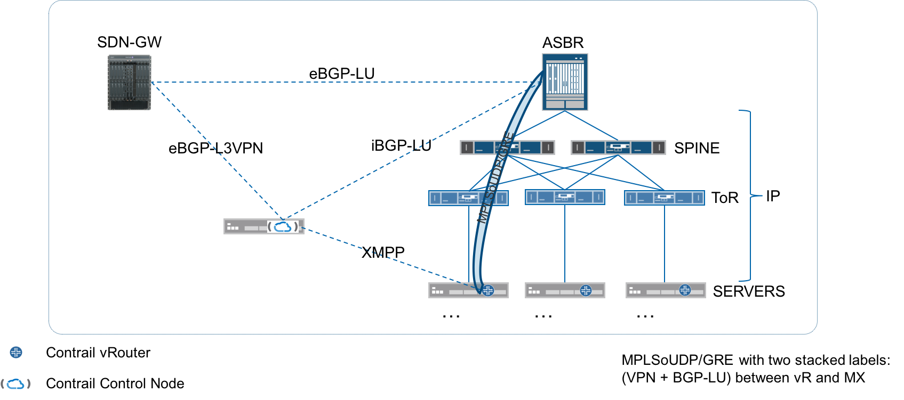

# 1. Introduction
Contrail support for Inter AS Option C (3 Label)
# 2. Problem statement
The larger use case is to virtualize the CPE and offer services in the DC. The
connection between the DC and customer premise is over multiple AS'es, and they
have to rely on a transit provider. Service providers may have to use different
providers to reach their Residential and Commercial customers.
In short multiple vendors become involved and lining up the tunneling
technologies across these vendors becomes challenging.
MPLS however is deployed widely. And MPLS's overhead is much lower compared to
other encaps. In the cable world, MTU size of 1527 is common and they have to
live within that else the customer can't avail of things such as banking, day
trading etc.
Further, in order to decrease their reliance on the transit provider, providers
want to avoid having the transit provider participate in the control plane.
For these reasons some providers  prefer L3VPN Inter-AS Option C.

# 3. Proposed solution
The following diagram shows the network connections and roles of different
components in the solution.

The controller maintains an eBGP-L3VPN session with the SDN-GW router and
iBGP-LU with the ASBR router. Additionally, in order to avoid introducing MPLS
in the fabric and supporting MPLS tunnels on the vRouter we will cantinue to use
IP tunnels between the vRouters and the ASBR(s).

The controller exchanges labeled routes with the vRouters over XMPP.

The vRouter uses MPLSoUDP to reach the ASBR and encapsulates two labels within
it - the inner VPN lablel and outer BGP-LU label. In the opposite direction, the
vRouter will terminate the MPLSoUDP tunnel and process the two labels.

The only drawback/compromise in this solution is that the MTU overhead due to
using IP tunnels in the fabric reduces the overall MTU end to end.

## 3.1 Alternatives considered
### 3.1.1 Implement BGP on vRouter
Implement BGP on vRouter. Peer the ToR with every vRouter (in that rack).
Operationally, the administrator will have to configure the ToR to peer with
every vRouter in that rack.
CLOS fabric will also do MPLS forwarding.
Every vR has to advertise BGP LU route to itself (label 3 - implicit null).
Run BGP LU only between MX and spine, spine and leaf, leaf and vR.
This option involves fair amount of new code for us as well as additional
operational tasks for customer (BGP peering on ToR with vRouter - configuring
and monitoring those sessions).
### 3.1.2 Run BGP from Controller to every ToR.
Run BGP from Controller to every ToR.
XMPP from Controller to vRouter (as usual).
Carry the BGP routes and advertise them into XMPP to the vRouter. vRouter learns
the BGP-LU routes using XMPP. Instead of running BGP-LU directly to the ToR.
Both ToRs will advertise different labels for same BGP-LU destination. No
global coordination of labels.
Controller has to know which vRouter is behind which ToR and advertise only the
corresponding ToR's routes to the corresponding vRouters. Therefore, Controller
will have to maintain a RIB per ToR.
vRouters attached to a ToR subscribe to the Routing Table corresponding to that
ToR.
vRouter will have to somehow be informed or know who its ToR is
(during provisioning). And vRouter will subscribe to the corresponding Routing
Table on the Controller.
Operationally, this option is less work for the administrator however fairly
challenging for us in terms of implementation (maintaining per-ToR routing table
on the Controller, etc).
## 3.2 API schema changes
"inet-labeled-unicast" (iBGP-LU) as an address family needs to be supported in
the UI for adding BGP peers to the Controller. This is because the SDNGW as
depicted in the attached diagram will be an iBGP-LU peer for the Controller.
Additionally, we will need a per-neighbor knob to control default encap for vpn
routes, in this configuration we will need it to be MPLS.
We will need to ensure that provisioning of the iBGP-LU peering and the default
encapsulation knob is exposed via the corresponding RESTful API.
## 3.3 User workflow impact
TBD
## 3.4 UI changes
Visibility of the flows that are encapsulated by two tags should be provided in
the analytics engine.
## 3.5 Notification impact
TBD

# 4. Implementation
## 4.1 Work items
### 4.1.1 Controller
A new inet.3 table and the corresponding bgp table will be added to master
instance by default.
Schema changes will be made to support the new address family and a config
knob per peer to control the default vpn route encapsulation. The knob will
determine that we need to set the encapsulation to MPLS when it is not specified
in the route from the SDN-GW. The vRouter should set the encapsulation to MPLS
when advertising the route.
The controller will encode/decode the new address family/ sub address family to
and from BGP peers and Agents (XMPP).
### 4.1.2 Agent
### 4.1.3 vRouter
### 4.1.4 UI
### 4.1.5 Analytics

# 5. Performance and scaling impact
## 5.1 API and control plane
#### Scaling and performance for API and control plane

## 5.2 Forwarding performance
#### Scaling and performance for API and forwarding

# 6. Upgrade/HA
The implementation accounts for ASBR (MX) redundancy. As well as for the SDNGW
(ALU) redundancy. All regular Controller HA requirements are also supported.

# 7. Deprecations

# 8. Dependencies

# 9. Testing
## 9.1 Unit tests
### 9.1.1 Controller
End to end integration test.

## 9.2 Dev tests
## 9.3 System tests

# 10. Documentation Impact

# 11. References
