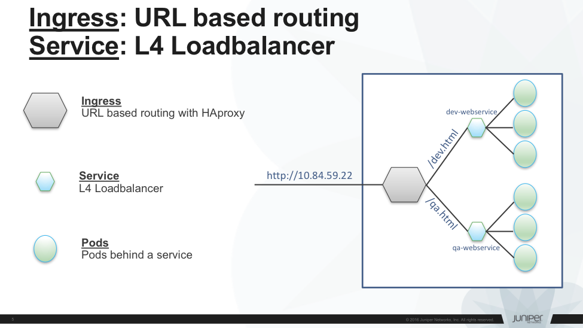

## __K8S Ingress Introduction__
k8s services can be exposed to external (outside of the cluster) in many
ways. Popular ways are <https://kubernetes.io/docs/concepts/services-networking/ingress/#alternatives>. Ingress is another way to expose the service to external. Ingress provides layer 7 load balancing whereas the others provide layer 4 load balancing.

### __Types of ingress__
1. Single Service: 
    This type is as equivalent to exposing the services with other ways. 

    Sample yaml to create single-service: 
    &nbsp;&nbsp;&nbsp;&nbsp;apiVersion: extensions/v1beta1 
    &nbsp;&nbsp;&nbsp;&nbsp;kind: Ingress 
    &nbsp;&nbsp;&nbsp;&nbsp;metadata: 
    &nbsp;&nbsp;&nbsp;&nbsp;&nbsp;&nbsp;&nbsp;&nbsp;name: single-service 
    &nbsp;&nbsp;&nbsp;&nbsp;spec: 
    &nbsp;&nbsp;&nbsp;&nbsp;&nbsp;&nbsp;&nbsp;&nbsp;backend:  &nbsp;&nbsp;&nbsp;&nbsp;&nbsp;&nbsp;&nbsp;&nbsp;&nbsp;&nbsp;&nbsp;&nbsp;serviceName: nginx     &nbsp;&nbsp;&nbsp;&nbsp;&nbsp;&nbsp;&nbsp;&nbsp;&nbsp;&nbsp;&nbsp;&nbsp;servicePort: 80 

    All the traffic would be routed to nginx service. 

2.  Simple fanout: 
    Based on the url path, the traffic would be routed to desired service. 

    Sample yaml to create simple-fanout: 
    &nbsp;&nbsp;&nbsp;&nbsp;apiVersion: extensions/v1beta1 
    &nbsp;&nbsp;&nbsp;&nbsp;kind: ingress 
    &nbsp;&nbsp;&nbsp;&nbsp;metadata: 
    &nbsp;&nbsp;&nbsp;&nbsp;&nbsp;&nbsp;&nbsp;&nbsp;name: simple-fanout 
    &nbsp;&nbsp;&nbsp;&nbsp;spec: 
    &nbsp;&nbsp;&nbsp;&nbsp;&nbsp;&nbsp;&nbsp;&nbsp;rules: 
    &nbsp;&nbsp;&nbsp;&nbsp;&nbsp;&nbsp;&nbsp;&nbsp;&nbsp;&nbsp;&nbsp;&nbsp;- &nbsp;&nbsp;http: 
&nbsp;&nbsp;&nbsp;&nbsp;&nbsp;&nbsp;&nbsp;&nbsp;&nbsp;&nbsp;&nbsp;&nbsp;&nbsp;&nbsp;&nbsp;&nbsp;&nbsp;&nbsp;&nbsp;&nbsp;paths: 
&nbsp;&nbsp;&nbsp;&nbsp;&nbsp;&nbsp;&nbsp;&nbsp;&nbsp;&nbsp;&nbsp;&nbsp;&nbsp;&nbsp;&nbsp;&nbsp;&nbsp;&nbsp;&nbsp;&nbsp;&nbsp;-&nbsp;&nbsp;path: /qa.html 
&nbsp;&nbsp;&nbsp;&nbsp;&nbsp;&nbsp;&nbsp;&nbsp;&nbsp;&nbsp;&nbsp;&nbsp;&nbsp;&nbsp;&nbsp;&nbsp;&nbsp;&nbsp;&nbsp;&nbsp;&nbsp;&nbsp;&nbsp;&nbsp;&nbsp;backend: 
&nbsp;&nbsp;&nbsp;&nbsp;&nbsp;&nbsp;&nbsp;&nbsp;&nbsp;&nbsp;&nbsp;&nbsp;&nbsp;&nbsp;&nbsp;&nbsp;&nbsp;&nbsp;&nbsp;&nbsp;&nbsp;&nbsp;&nbsp;&nbsp;&nbsp;&nbsp;&nbsp;&nbsp;&nbsp;serviceName: qa-webserver 
&nbsp;&nbsp;&nbsp;&nbsp;&nbsp;&nbsp;&nbsp;&nbsp;&nbsp;&nbsp;&nbsp;&nbsp;&nbsp;&nbsp;&nbsp;&nbsp;&nbsp;&nbsp;&nbsp;&nbsp;&nbsp;&nbsp;&nbsp;&nbsp;&nbsp;&nbsp;&nbsp;&nbsp;&nbsp;servicePort: 80 
&nbsp;&nbsp;&nbsp;&nbsp;&nbsp;&nbsp;&nbsp;&nbsp;&nbsp;&nbsp;&nbsp;&nbsp;&nbsp;&nbsp;&nbsp;&nbsp;&nbsp;&nbsp;&nbsp;&nbsp;&nbsp;-&nbsp;&nbsp;path: /dev.html 
&nbsp;&nbsp;&nbsp;&nbsp;&nbsp;&nbsp;&nbsp;&nbsp;&nbsp;&nbsp;&nbsp;&nbsp;&nbsp;&nbsp;&nbsp;&nbsp;&nbsp;&nbsp;&nbsp;&nbsp;&nbsp;&nbsp;&nbsp;&nbsp;&nbsp;backend: 
&nbsp;&nbsp;&nbsp;&nbsp;&nbsp;&nbsp;&nbsp;&nbsp;&nbsp;&nbsp;&nbsp;&nbsp;&nbsp;&nbsp;&nbsp;&nbsp;&nbsp;&nbsp;&nbsp;&nbsp;&nbsp;&nbsp;&nbsp;&nbsp;&nbsp;&nbsp;&nbsp;&nbsp;&nbsp;serviceName: dev-webserver 
&nbsp;&nbsp;&nbsp;&nbsp;&nbsp;&nbsp;&nbsp;&nbsp;&nbsp;&nbsp;&nbsp;&nbsp;&nbsp;&nbsp;&nbsp;&nbsp;&nbsp;&nbsp;&nbsp;&nbsp;&nbsp;&nbsp;&nbsp;&nbsp;&nbsp;&nbsp;&nbsp;&nbsp;&nbsp;servicePort: 80 

    If the incoming traffic's url path matches to qa.html, the traffic would be routed to qa-webserver service. If the incoming traffic ul matches to dev.html, the traffic's would be touted to dev-webserver. 

3.  Name based Virtual Hosting: 
    Multiple host names use the same ip address. Based on the Host, traffic would be routed to desired service. 

    Sample yaml to create name based virtual-hosting: 
&nbsp;&nbsp;&nbsp;&nbsp;apiVersion: extensions/v1beta1 
&nbsp;&nbsp;&nbsp;&nbsp;kind: ingress 
&nbsp;&nbsp;&nbsp;&nbsp;metadata: 
&nbsp;&nbsp;&nbsp;&nbsp;&nbsp;&nbsp;&nbsp;&nbsp;name: virtual-host 
&nbsp;&nbsp;&nbsp;&nbsp;spec: 
&nbsp;&nbsp;&nbsp;&nbsp;&nbsp;&nbsp;&nbsp;&nbsp;rules: 
&nbsp;&nbsp;&nbsp;&nbsp;&nbsp;&nbsp;&nbsp;&nbsp;&nbsp;&nbsp;&nbsp;&nbsp;-  host: maps.google.com 
&nbsp;&nbsp;&nbsp;&nbsp;&nbsp;&nbsp;&nbsp;&nbsp;&nbsp;&nbsp;&nbsp;&nbsp;&nbsp;&nbsp;&nbsp;http 
&nbsp;&nbsp;&nbsp;&nbsp;&nbsp;&nbsp;&nbsp;&nbsp;&nbsp;&nbsp;&nbsp;&nbsp;&nbsp;&nbsp;&nbsp;&nbsp;&nbsp;&nbsp;&nbsp;&nbsp;paths: 
&nbsp;&nbsp;&nbsp;&nbsp;&nbsp;&nbsp;&nbsp;&nbsp;&nbsp;&nbsp;&nbsp;&nbsp;&nbsp;&nbsp;&nbsp;&nbsp;&nbsp;&nbsp;&nbsp;&nbsp;-  backend: 
&nbsp;&nbsp;&nbsp;&nbsp;&nbsp;&nbsp;&nbsp;&nbsp;&nbsp;&nbsp;&nbsp;&nbsp;&nbsp;&nbsp;&nbsp;&nbsp;&nbsp;&nbsp;&nbsp;&nbsp;&nbsp;&nbsp;&nbsp;&nbsp;&nbsp;&nbsp;serviceName: google-maps-webserver 
&nbsp;&nbsp;&nbsp;&nbsp;&nbsp;&nbsp;&nbsp;&nbsp;&nbsp;&nbsp;&nbsp;&nbsp;&nbsp;&nbsp;&nbsp;&nbsp;&nbsp;&nbsp;&nbsp;&nbsp;&nbsp;&nbsp;&nbsp;&nbsp;&nbsp;&nbsp;servicePort: 80 
&nbsp;&nbsp;&nbsp;&nbsp;&nbsp;&nbsp;&nbsp;&nbsp;&nbsp;&nbsp;&nbsp;&nbsp;-  host: images.google.com 
&nbsp;&nbsp;&nbsp;&nbsp;&nbsp;&nbsp;&nbsp;&nbsp;&nbsp;&nbsp;&nbsp;&nbsp;&nbsp;&nbsp;&nbsp;http 
&nbsp;&nbsp;&nbsp;&nbsp;&nbsp;&nbsp;&nbsp;&nbsp;&nbsp;&nbsp;&nbsp;&nbsp;&nbsp;&nbsp;&nbsp;&nbsp;&nbsp;&nbsp;&nbsp;&nbsp;paths: 
&nbsp;&nbsp;&nbsp;&nbsp;&nbsp;&nbsp;&nbsp;&nbsp;&nbsp;&nbsp;&nbsp;&nbsp;&nbsp;&nbsp;&nbsp;&nbsp;&nbsp;&nbsp;&nbsp;&nbsp;-  backend: 
&nbsp;&nbsp;&nbsp;&nbsp;&nbsp;&nbsp;&nbsp;&nbsp;&nbsp;&nbsp;&nbsp;&nbsp;&nbsp;&nbsp;&nbsp;&nbsp;&nbsp;&nbsp;&nbsp;&nbsp;&nbsp;&nbsp;&nbsp;&nbsp;&nbsp;&nbsp;serviceName: google-images-webserver 
&nbsp;&nbsp;&nbsp;&nbsp;&nbsp;&nbsp;&nbsp;&nbsp;&nbsp;&nbsp;&nbsp;&nbsp;&nbsp;&nbsp;&nbsp;&nbsp;&nbsp;&nbsp;&nbsp;&nbsp;&nbsp;&nbsp;&nbsp;&nbsp;&nbsp;&nbsp;servicePort: 80 

    If the incoming traffic's host header matches to maps.google.com, the traffic would be routed to google-maps-webserver. If the incoming traffic's host header matches to images.google.com, the traffic would be routed to google-images-webserver. 

For more information please refer
<https://kubernetes.io/docs/concepts/services-networking/ingress/>

## **Ingress in Contrail**
Ingress is implemented through load balancer feature in contrail.
[Please refer contrail feature guide for more information on contrail
load balancer]. Whenever ingress is configured in k8s, contrail-kube-manager creates the load balancer object in contrail-controller. Contrail service contrail-svc-monitor listens for the load balancer objects and launches the haproxy with appropriate configuration based on the ingress spec rules in active-standby mode in two active compute nodes.

### __Detailed Explanation with simple-fanout example:__
#### __Simple-fanout yaml:__ 
&nbsp;&nbsp;&nbsp;&nbsp;&nbsp;&nbsp;&nbsp;&nbsp;apiVersion: extensions/v1beta1 
&nbsp;&nbsp;&nbsp;&nbsp;&nbsp;&nbsp;&nbsp;&nbsp;kind: ingress 
&nbsp;&nbsp;&nbsp;&nbsp;&nbsp;&nbsp;&nbsp;&nbsp;metadata: 
&nbsp;&nbsp;&nbsp;&nbsp;&nbsp;&nbsp;&nbsp;&nbsp;&nbsp;&nbsp;&nbsp;&nbsp;name: simple-fanout 
&nbsp;&nbsp;&nbsp;&nbsp;&nbsp;&nbsp;&nbsp;&nbsp;spec: 
&nbsp;&nbsp;&nbsp;&nbsp;&nbsp;&nbsp;&nbsp;&nbsp;&nbsp;&nbsp;&nbsp;&nbsp;rules: 
&nbsp;&nbsp;&nbsp;&nbsp;&nbsp;&nbsp;&nbsp;&nbsp;&nbsp;&nbsp;&nbsp;&nbsp;&nbsp;&nbsp;&nbsp;&nbsp;- http: 
&nbsp;&nbsp;&nbsp;&nbsp;&nbsp;&nbsp;&nbsp;&nbsp;&nbsp;&nbsp;&nbsp;&nbsp;&nbsp;&nbsp;&nbsp;&nbsp;&nbsp;&nbsp;&nbsp;&nbsp;&nbsp;&nbsp;paths: 
&nbsp;&nbsp;&nbsp;&nbsp;&nbsp;&nbsp;&nbsp;&nbsp;&nbsp;&nbsp;&nbsp;&nbsp;&nbsp;&nbsp;&nbsp;&nbsp;&nbsp;&nbsp;&nbsp;&nbsp;&nbsp;&nbsp;&nbsp;&nbsp;&nbsp;-  path: /qa.html 
&nbsp;&nbsp;&nbsp;&nbsp;&nbsp;&nbsp;&nbsp;&nbsp;&nbsp;&nbsp;&nbsp;&nbsp;&nbsp;&nbsp;&nbsp;&nbsp;&nbsp;&nbsp;&nbsp;&nbsp;&nbsp;&nbsp;&nbsp;&nbsp;&nbsp;&nbsp;&nbsp;&nbsp;backend: 
&nbsp;&nbsp;&nbsp;&nbsp;&nbsp;&nbsp;&nbsp;&nbsp;&nbsp;&nbsp;&nbsp;&nbsp;&nbsp;&nbsp;&nbsp;&nbsp;&nbsp;&nbsp;&nbsp;&nbsp;&nbsp;&nbsp;&nbsp;&nbsp;&nbsp;&nbsp;&nbsp;&nbsp;&nbsp;&nbsp;&nbsp;serviceName: qa-webserver 
&nbsp;&nbsp;&nbsp;&nbsp;&nbsp;&nbsp;&nbsp;&nbsp;&nbsp;&nbsp;&nbsp;&nbsp;&nbsp;&nbsp;&nbsp;&nbsp;&nbsp;&nbsp;&nbsp;&nbsp;&nbsp;&nbsp;&nbsp;&nbsp;&nbsp;&nbsp;&nbsp;&nbsp;&nbsp;&nbsp;&nbsp;servicePort: 80 
&nbsp;&nbsp;&nbsp;&nbsp;&nbsp;&nbsp;&nbsp;&nbsp;&nbsp;&nbsp;&nbsp;&nbsp;&nbsp;&nbsp;&nbsp;&nbsp;&nbsp;&nbsp;&nbsp;&nbsp;&nbsp;&nbsp;paths: 
&nbsp;&nbsp;&nbsp;&nbsp;&nbsp;&nbsp;&nbsp;&nbsp;&nbsp;&nbsp;&nbsp;&nbsp;&nbsp;&nbsp;&nbsp;&nbsp;&nbsp;&nbsp;&nbsp;&nbsp;&nbsp;&nbsp;&nbsp;&nbsp;&nbsp;-  path: /dev.html 
&nbsp;&nbsp;&nbsp;&nbsp;&nbsp;&nbsp;&nbsp;&nbsp;&nbsp;&nbsp;&nbsp;&nbsp;&nbsp;&nbsp;&nbsp;&nbsp;&nbsp;&nbsp;&nbsp;&nbsp;&nbsp;&nbsp;&nbsp;&nbsp;&nbsp;&nbsp;&nbsp;&nbsp;backend: 
&nbsp;&nbsp;&nbsp;&nbsp;&nbsp;&nbsp;&nbsp;&nbsp;&nbsp;&nbsp;&nbsp;&nbsp;&nbsp;&nbsp;&nbsp;&nbsp;&nbsp;&nbsp;&nbsp;&nbsp;&nbsp;&nbsp;&nbsp;&nbsp;&nbsp;&nbsp;&nbsp;&nbsp;&nbsp;&nbsp;&nbsp;serviceName: dev-webserver 
&nbsp;&nbsp;&nbsp;&nbsp;&nbsp;&nbsp;&nbsp;&nbsp;&nbsp;&nbsp;&nbsp;&nbsp;&nbsp;&nbsp;&nbsp;&nbsp;&nbsp;&nbsp;&nbsp;&nbsp;&nbsp;&nbsp;&nbsp;&nbsp;&nbsp;&nbsp;&nbsp;&nbsp;&nbsp;&nbsp;&nbsp;servicePort: 80 

#### __Creating simple-fanout ingress in k8s:__
&nbsp;&nbsp;&nbsp;&nbsp;&nbsp;&nbsp;&nbsp;&nbsp;Kubectl create –f simple-fanout.yaml –n &lt;namespace\_name&gt; 

#### __K8s-events:__
&nbsp;&nbsp;&nbsp;&nbsp;Kubectl connects to kube-api-server and creates the simps-fanout ingress in k8s.
#### __Contrail-events:__
##### __Contrail-kube-manager:__
Contrail-kube-manager register for event notification for interested resources with kube-api-server which includes ingress. When ingress object is created/modified/deleted in kube-api-server,  It will send an event notification to contrail-kibe-manager. Contrail-kube-manager creates load balancer, virtual-machine-interface for load balancer and instance-ip for virtual-machine-interface from pod-ipam in cluster-network. If the external(public) pool available, it allocates external-ip and associate to the virtual-machine-interface. The fq\_name of the external pool is \[&lt;public\_network_project&gt;,\_\_public\_\_,\_\_fip\_pool\_public\_\_\].
Finally it updates the cluseter-ip and external-ip in k8s.

##### __Contrail-svc-monitor:__
Contrail-svc-monitor listens for event notifications for contrail load balancer objects. When contrail-svc-monitor gets the create load balancer event from contrail-api-server, it generates the haproxy configuration file with simple-fanout ingress spec rules, finds two
active compute nodes for active-standby mode and sends to contrail-vrouter-agents as service-instances through control-node to launch haproxy with generated haproxy config

##### __Contrail-vrouter-agent:__
Contrail-vrouter-agent uses the opencontrail\_vrouter\_netns script to launch the haproxy inside the network namespace with generated haproxy configuration.

#### __Viewing the ingress information:__
##### __k8s:__

###### __To View the http rules:__
&nbsp;&nbsp;&nbsp;&nbsp;kubectl describe ing/simple-fanout –n &lt;namespace\_name&gt;

&nbsp;&nbsp;&nbsp;&nbsp;Name: simple-fanout 
&nbsp;&nbsp;&nbsp;&nbsp;Namespace: default 
&nbsp;&nbsp;&nbsp;&nbsp;Address: 
&nbsp;&nbsp;&nbsp;&nbsp;&nbsp;&nbsp;&nbsp;&nbsp;&nbsp;&nbsp;&nbsp;&nbsp;Default backend: default-http-backend:80 (&lt;none&gt;) 
&nbsp;&nbsp;&nbsp;&nbsp;&nbsp;&nbsp;&nbsp;&nbsp;&nbsp;&nbsp;&nbsp;&nbsp;Rules: 
&nbsp;&nbsp;&nbsp;&nbsp;&nbsp;&nbsp;&nbsp;&nbsp;&nbsp;&nbsp;&nbsp;&nbsp;&nbsp;&nbsp;&nbsp;&nbsp;&nbsp;&nbsp;&nbsp;&nbsp;&nbsp;&nbsp;Host&nbsp;&nbsp;&nbsp;&nbsp;&nbsp;&nbsp;Path&nbsp;&nbsp;&nbsp;&nbsp;&nbsp;&nbsp;&nbsp;&nbsp;&nbsp;&nbsp;Backends 
&nbsp;&nbsp;&nbsp;&nbsp;&nbsp;&nbsp;&nbsp;&nbsp;&nbsp;&nbsp;&nbsp;&nbsp;&nbsp;&nbsp;&nbsp;&nbsp;&nbsp;&nbsp;&nbsp;------&nbsp;&nbsp;&nbsp;&nbsp;---------&nbsp;&nbsp;&nbsp;--------------- 
&nbsp;&nbsp;&nbsp;&nbsp;&nbsp;&nbsp;&nbsp;&nbsp;&nbsp;&nbsp;&nbsp;&nbsp;&nbsp;&nbsp;&nbsp;&nbsp;&nbsp;&nbsp;&nbsp;&nbsp;&nbsp;\* 
&nbsp;&nbsp;&nbsp;&nbsp;&nbsp;&nbsp;&nbsp;&nbsp;&nbsp;&nbsp;&nbsp;&nbsp;&nbsp;&nbsp;&nbsp;&nbsp;&nbsp;&nbsp;&nbsp;&nbsp;&nbsp;&nbsp;&nbsp;&nbsp;&nbsp;&nbsp;&nbsp;&nbsp;&nbsp;&nbsp;&nbsp;&nbsp;&nbsp;/qa.html&nbsp;&nbsp;&nbsp;&nbsp;&nbsp;&nbsp;qa-webserver:80 (&lt;none&gt;) 
&nbsp;&nbsp;&nbsp;&nbsp;&nbsp;&nbsp;&nbsp;&nbsp;&nbsp;&nbsp;&nbsp;&nbsp;&nbsp;&nbsp;&nbsp;&nbsp;&nbsp;&nbsp;&nbsp;&nbsp;&nbsp;&nbsp;&nbsp;&nbsp;&nbsp;&nbsp;&nbsp;&nbsp;&nbsp;&nbsp;&nbsp;&nbsp;/dev.html&nbsp;&nbsp;&nbsp;&nbsp;dev-webserver:80 (&lt;none&gt;) 
&nbsp;&nbsp;&nbsp;&nbsp;&nbsp;&nbsp;&nbsp;&nbsp;&nbsp;&nbsp;&nbsp;&nbsp;Annotations: 
&nbsp;&nbsp;&nbsp;&nbsp;&nbsp;&nbsp;&nbsp;&nbsp;&nbsp;&nbsp;&nbsp;&nbsp;No events. 

###### __To View the ip information:__
&nbsp;&nbsp;&nbsp;&nbsp;kubectl get ing/simple-fanout -o=custom-columns= 
&nbsp;&nbsp;&nbsp;&nbsp;&nbsp;&nbsp;&nbsp;&nbsp;&nbsp;&nbsp;&nbsp;&nbsp;&nbsp;&nbsp;&nbsp;&nbsp;NAME:.metadata.name, 
&nbsp;&nbsp;&nbsp;&nbsp;&nbsp;&nbsp;&nbsp;&nbsp;&nbsp;&nbsp;&nbsp;&nbsp;&nbsp;&nbsp;&nbsp;&nbsp;CLUSTER-IP:.metadata.annotations.clusterIP, 
&nbsp;&nbsp;&nbsp;&nbsp;&nbsp;&nbsp;&nbsp;&nbsp;&nbsp;&nbsp;&nbsp;&nbsp;&nbsp;&nbsp;&nbsp;&nbsp;EXTERNAL-IP:.metadata.annotations.externalIP -n &lt;namespace_name&gt; 
&nbsp;&nbsp;&nbsp;&nbsp;NAME&nbsp;&nbsp;&nbsp;&nbsp;&nbsp;&nbsp;&nbsp;&nbsp;&nbsp;&nbsp;&nbsp;&nbsp;&nbsp;&nbsp;&nbsp;&nbsp;CLUSTER-IP&nbsp;&nbsp;&nbsp;&nbsp;&nbsp;&nbsp;&nbsp;&nbsp;EXTERNAL-IP 
&nbsp;&nbsp;&nbsp;&nbsp;simple-fanout&nbsp;&nbsp;&nbsp;&nbsp;10.47.255.248&nbsp;&nbsp;&nbsp;&nbsp;10.84.59.22

##### __Contrail:__
##### __Contrail-api:__
http://&lt;contrail-controller-node&gt;:8082/loadbalancer/&lt;ingress\_uuid&gt; | python -m json.tool
##### __contrail-control:__
http://&lt;contrail-controller-node&gt;:8083/Snh\_IFMapTableShowReq?table\_name=service\_instance&search\_string=
##### __contrail-vrouter-agent:__
###### __ifmap\_agent:__
http://&lt;conril-compute-node&gt;:8085/Snh\_ShowIFMapAgentReq?table\_name=service\_instance&node\_sub\_string=&link\_type\_sub\_string=&link\_node\_sub\_string=
###### __opencontrail\_vrouter\_netns:__
http://&lt;contrail-compute-node&gt;:8085/Snh\_ServiceInstanceReq?uuid=
###### __haproxy configuration:__
Haproxy configuration is stored in /var/lib/contrail/loadbalancer/
haproxy/&lt;ingress\_uuid&gt;/haproxy.conf

###### __Haproxy configuration for simple-fanout:__
> global
>
> daemon
>
> user haproxy
>
> group haproxy
>
> log /dev/log local0
>
> log /dev/log local1 notice
>
> tune.ssl.default-dh-param 2048
>
> ssl-default-bind-ciphers
> ECDH+AESGCM:DH+AESGCM:ECDH+AES256:DH+AES256:ECDH+AES128:DH+AES:ECDH+3DES:DH+3DES:RSA+AESGCM:RSA+AES:RSA+3DES:!aNULL:!MD5:!DSS
>
> ulimit-n 200000
>
> maxconn 65000
>
> stats socket
> /var/lib/contrail/loadbalancer/haproxy/aa13aa8d-1faf-11e7-a423-00259030b0fe/haproxy.sock
> mode 0666 level user
>
> defaults
>
> log global
>
> retries 3
>
> option redispatch
>
> timeout connect 5000
>
> timeout client 300000
>
> timeout server 300000
>
> frontend e602faab-00e2-4ee2-b618-a420d8bb5128
>
> option tcplog
>
> bind 10.47.255.248:80
>
> mode http
>
> option forwardfor
>
> acl 8dc82a38-d61b-4853-96f2-e82c0ff66801\_path path /qa.html
>
> use\_backend 8dc82a38-d61b-4853-96f2-e82c0ff66801 if
> 8dc82a38-d61b-4853-96f2-e82c0ff66801\_path
>
> acl 56c180d1-9205-47d2-8eb7-4dba6ed5a6ae\_path path /dev.html
>
> use\_backend 56c180d1-9205-47d2-8eb7-4dba6ed5a6ae if
> 56c180d1-9205-47d2-8eb7-4dba6ed5a6ae\_path
>
> backend 8dc82a38-d61b-4853-96f2-e82c0ff66801
>
> mode http
>
> balance roundrobin
>
> option forwardfor
>
> server c3ee3971-6207-4239-8112-615c1741a3d5 10.96.13.170:80 weight 1
>
> backend 56c180d1-9205-47d2-8eb7-4dba6ed5a6ae
>
> mode http
>
> balance roundrobin
>
> option forwardfor
>
> server 671990da-51c5-46ea-b995-e3648f1bf2b7 10.98.199.61:80 weight 1

#### __Specifying the external-ip in yaml:__
An option is given to provide the external-ip in the yaml file. If the external-ip is provided, contrail-kube-manager uses the external-ip
otherwise it allocates from the external (public) pool if it is available

##### __Simple-fanout with external(public) ip:__
&nbsp;&nbsp;&nbsp;&nbsp;&nbsp;&nbsp;&nbsp;&nbsp;apiVersion: extensions/v1beta1 
&nbsp;&nbsp;&nbsp;&nbsp;&nbsp;&nbsp;&nbsp;&nbsp;kind: ingress 
&nbsp;&nbsp;&nbsp;&nbsp;&nbsp;&nbsp;&nbsp;&nbsp;metadata: 
&nbsp;&nbsp;&nbsp;&nbsp;&nbsp;&nbsp;&nbsp;&nbsp;&nbsp;&nbsp;&nbsp;&nbsp;name: simple-fanout 
&nbsp;&nbsp;&nbsp;&nbsp;&nbsp;&nbsp;&nbsp;&nbsp;&nbsp;&nbsp;&nbsp;&nbsp;annotations: 
&nbsp;&nbsp;&nbsp;&nbsp;&nbsp;&nbsp;&nbsp;&nbsp;&nbsp;&nbsp;&nbsp;&nbsp;&nbsp;&nbsp;&nbsp;&nbsp;externalIP: 10.84.59.22 
&nbsp;&nbsp;&nbsp;&nbsp;&nbsp;&nbsp;&nbsp;&nbsp;spec: 
&nbsp;&nbsp;&nbsp;&nbsp;&nbsp;&nbsp;&nbsp;&nbsp;&nbsp;&nbsp;&nbsp;&nbsp;rules: 
&nbsp;&nbsp;&nbsp;&nbsp;&nbsp;&nbsp;&nbsp;&nbsp;&nbsp;&nbsp;&nbsp;&nbsp;- &nbsp;&nbsp;http: 
&nbsp;&nbsp;&nbsp;&nbsp;&nbsp;&nbsp;&nbsp;&nbsp;&nbsp;&nbsp;&nbsp;&nbsp;&nbsp;&nbsp;&nbsp;&nbsp;&nbsp;&nbsp;&nbsp;&nbsp;paths: 
&nbsp;&nbsp;&nbsp;&nbsp;&nbsp;&nbsp;&nbsp;&nbsp;&nbsp;&nbsp;&nbsp;&nbsp;&nbsp;&nbsp;&nbsp;&nbsp;&nbsp;&nbsp;&nbsp;&nbsp;&nbsp;-&nbsp;&nbsp;path: /qa.html 
&nbsp;&nbsp;&nbsp;&nbsp;&nbsp;&nbsp;&nbsp;&nbsp;&nbsp;&nbsp;&nbsp;&nbsp;&nbsp;&nbsp;&nbsp;&nbsp;&nbsp;&nbsp;&nbsp;&nbsp;&nbsp;&nbsp;&nbsp;&nbsp;&nbsp;backend: 
&nbsp;&nbsp;&nbsp;&nbsp;&nbsp;&nbsp;&nbsp;&nbsp;&nbsp;&nbsp;&nbsp;&nbsp;&nbsp;&nbsp;&nbsp;&nbsp;&nbsp;&nbsp;&nbsp;&nbsp;&nbsp;&nbsp;&nbsp;&nbsp;&nbsp;&nbsp;&nbsp;&nbsp;&nbsp;serviceName: qa-webserver 
&nbsp;&nbsp;&nbsp;&nbsp;&nbsp;&nbsp;&nbsp;&nbsp;&nbsp;&nbsp;&nbsp;&nbsp;&nbsp;&nbsp;&nbsp;&nbsp;&nbsp;&nbsp;&nbsp;&nbsp;&nbsp;&nbsp;&nbsp;&nbsp;&nbsp;&nbsp;&nbsp;&nbsp;&nbsp;servicePort: 80 
&nbsp;&nbsp;&nbsp;&nbsp;&nbsp;&nbsp;&nbsp;&nbsp;&nbsp;&nbsp;&nbsp;&nbsp;&nbsp;&nbsp;&nbsp;&nbsp;&nbsp;&nbsp;&nbsp;&nbsp;&nbsp;-&nbsp;&nbsp;path: /dev.html 
&nbsp;&nbsp;&nbsp;&nbsp;&nbsp;&nbsp;&nbsp;&nbsp;&nbsp;&nbsp;&nbsp;&nbsp;&nbsp;&nbsp;&nbsp;&nbsp;&nbsp;&nbsp;&nbsp;&nbsp;&nbsp;&nbsp;&nbsp;&nbsp;&nbsp;backend: 
&nbsp;&nbsp;&nbsp;&nbsp;&nbsp;&nbsp;&nbsp;&nbsp;&nbsp;&nbsp;&nbsp;&nbsp;&nbsp;&nbsp;&nbsp;&nbsp;&nbsp;&nbsp;&nbsp;&nbsp;&nbsp;&nbsp;&nbsp;&nbsp;&nbsp;&nbsp;&nbsp;&nbsp;&nbsp;serviceName: dev-webserver 
&nbsp;&nbsp;&nbsp;&nbsp;&nbsp;&nbsp;&nbsp;&nbsp;&nbsp;&nbsp;&nbsp;&nbsp;&nbsp;&nbsp;&nbsp;&nbsp;&nbsp;&nbsp;&nbsp;&nbsp;&nbsp;&nbsp;&nbsp;&nbsp;&nbsp;&nbsp;&nbsp;&nbsp;&nbsp;servicePort: 80 

