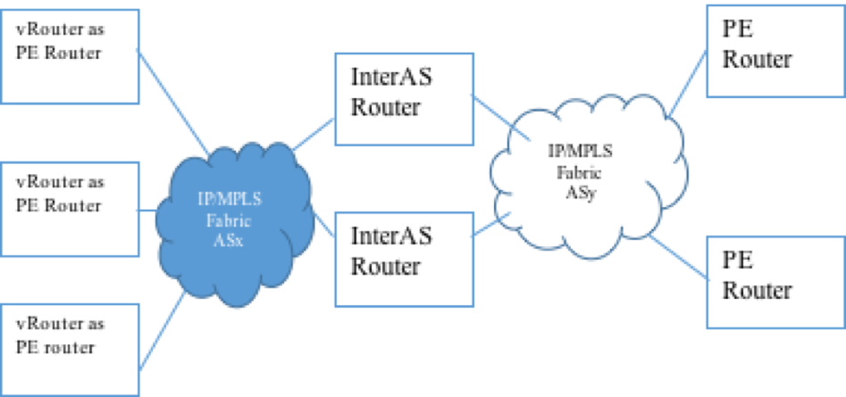

# 1. Introduction
To provide SD WAN L2 connectivity, Contrail will implement PBB EVPN tunneling.
This document describes the API, design and implementation details of Contrail
components to achieve this.

# 2. Problem statement
Support PBB EVPN tunneling

# 3. Proposed solution
Following diagram shows the network connections and roles of different compents
in the solution.

For PBB EVPN, Contrail implements the PE router with vRouter learning the C-MAC
in datapath and Contrail Control node learning the B-MAC via EVPN BGP route
exchanges. The endpoints are connected to the vRouter via attachment circuit
represented as Virtual Machine Interface(VMI) in contrail configuration.

All the PE routers in the network topology can be in the same autonomous system
or in a different autonomous system. An ASBR router implementing InterAS
Option B routing will be used if PE routers are in different autonous systems.
This document uses the vMX for performing InterAS option B routing.

Following diagram shows logical modeling of PBB bridge in Contrail. The
attachment circuit VMI with endpoints connected will be part of Virtual network
belonging to the service. MAC addresses of the endpoints will be learnt in
bridge table of the I Component. It will be referred as C-MAC. For endpoints in
remote PE routers, C-MAC will be learnt against the B-MAC of the PE router.
EVPN BGP route exchanges are used to learn the Backbone MAC addresses in B
Component. It will be referred as B-MAC.

For traffic coming from VMI(from endpoint), lookup in bridge table of I
Component will provide B-MAC to be used for forwarding. B-MAC lookup is done
in the bridge table of B Component to derive the PBB EVPN tunnel to forward
the traffic.

## 3.1 Configuration/API Model
This section provides details of configuration properties to configure PBB EVPN
and objects where this configuration is made.

### 3.1.1 MAC Learning
MAC learning will be implemented in datapath to support PBB EVPN. Endpoint MACs
will be learnt in the Ethernet bridge table. Configuration knobs will be
provided to enable/disable the mac learning behavior on Per Virtual Network
basis.

>
    i.   Enable-Mac-Learning: This Boolean attribute is configured on the
         Virtual Network to enable/disable the MAC learning
>
    ii.  MAC-Limit: Number of MACs allowed to be learnt on Virtual Network.
         Configuring this to zero disables MAC limit checks.
>
    iii. MAC Limit Action: Action(s) to be taken when number of unique MACs
         learnt on the Virtual network exceeds the configured value. Currently
         only “LOG” action will be supported. When this action is triggered, a
         message is logged in the format: “MAC Limit exceeded for <VN>:<Interface>”.
>
         Possible MAC limit actions for future support,
             DROP (Drop the traffic and skip MAC learning)
             SHUTDOWN (Bring down the VMI that violated the MAC limit)
>
    iv.  MAC-Aging Timer: Age timer for MACs learnt on Virtual Network.
         The minimum aging timeout value is 1 second and maximum value is unbounded.
         The default value will be 300 seconds.
>
    v.   MAC Move Limit: This attribute in combination with MAC move timer controls
         the number of MAC moves (across VMI) in a given time window.
>
    vi.  MAC Move Timer
>
    vii. MAC Move Limit Action: Action(s) to be when number of MAC Moves on the
         virtual network exceeds the configured value within MAC Move Timer.
         Currently only “LOG” action will be supported. When this action is
         triggered, a message is logged in the format:
         “MAC Move Limit exceeded for <VN>:<Interface>:<MAC>”.
>
         Possible MAC Move limit actions for future support,
             DROP (Drop the traffic and skip MAC learning)
             SHUTDOWN (Bring down the VMI that violated the MAC Move limit)

Following parameters will be configured at global level (global-system-config)
for ease configuration. Virtual network would inherit them from this
configuration if it is not explicitly configured.

      i. MAC Age timer
     ii. MAC Limit
    iii. MAC Limit action
     iv. MAC move limit
      v. MAC move timer
     vi. MAC move action

MAC learning/aging, limit events will be logged in analytics for ease of debugging.

### 3.1.2 PBB EVPN Configuration attribute
Following PBB EVPN configuration parameters will be configurable at Virtual Network.
>
    i.  Enable-PBB-EVPN: To enable/disable PBB EVPN tunneling on Virtual network.
>
    ii. ISID assignment mode:
        a. Single ISID mode: In this mode Virtual network will be assigned with
           single ISID value. There is a 1:1 mapping between the I-Component and
           B-Component in this mode.
        b. Multiple ISID mode: In this mode Virtual network will be configured
           with list of ISID. In this mode of operation, multiple I-Component
           will be mapped to one B-Component.
        In current release only Single ISID mode will be supported.
>
    iii. ISID List: Based on the ISID assignment mode, ISID list will either contain
         single ISID or list of ISIDs.
>
    iv. PBB ETREE Mode support: This Boolean will allow/disallow L2 communication
        between two end points connected to vRouters. When it is disallowed end point
        communication happens via a L3 gateway provisioned in the remote PE site.

## 3.2	B-MAC Allocation Scheme
Following B-MAC allocation schemes are considered and their Pros and Cons are listed below.

    a.	B-MAC per VMI
        In this scheme, MAC of the VMI will be used as B-MAC.

        Pros:
        i.  This allows remote PE routers to identify, based on the BGP EVPN
            route exchange B-MAC, when a VMI/Attachment circuit goes down.
        ii. MAC Flush of all end point MACs learnt against a B-MAC is limited
            to endpoints in the specific VMI.

        Cons:
        i.  Number of EVPN routes exchanged with remote PE routers is more.

    b.	B-MAC per Vrouter
        In this scheme, MAC configured on global vrouter object will be used as
        B-MAC for all VMI/Attachment circuit.

        Pros:
        i. Number of EVPN routes exchanged in BGP will be less.

        Cons:
        i.  Remote PE routers will not have an indication of which VMI is going down.
        ii. To trigger the flush end point MACs learnt against this B-MAC, MAC mobility
            extended community should be used. In that case, all the MACs learnt across
            all VMI will have to be flushed. Or, in the absence of this extended community,
            MAC table will be flushed only on MAC aging timer.

Considering the advantages of being able to detect the disconnection/link down event of VMI,
Option of ***BMAC per VMI*** is chosen.

## 3.3 Label Allocation Scheme
MPLS Label is advertised for every B-MAC in EVPN MAC route. Following different schemes
of label allocation are considered.

     a. Label per VMI
        In this scheme a unique label is assigned for each B-MAC. With B-MAC per VMI MAC
        allocation scheme, each VMI will be allocated with unique label.

        Pros:
        Label provides VMI to which packet needs to be forwarded when packet is received
        from the fabric. Destination lookup in the bridge table of I-Component can be
        avoided C- MAC address.

        Cons:
        On the vMX this introduces a scaling requirements as vMX implementing Inter AS
        option-B router will have to allocate mapping label.

     b. Label per VRF
        Label will be used to find the bridge table. i.e. label will be table-label
        which will indicate the bridge table of I Component to do the C-MAC destination
        mac lookup.

        Pros:
        Number of unique labels allocated will be lesser.

        Cons:
        Additional lookup needed for destination MAC address to identify the VMI for endpoint.

***Label per VRF*** option is chosen to reduce the scaling requirement on vMX
for InterAS option B routing.

## 3.4 Direct L2 communication for end points
For endpoints connected behind vRouter PE devices, direct communication at L2 is
controlled based on configuration. When it is allowed, vRouter bridges the traffic
from one VMI to other VMI interfaces or to endpoints on other vRouters. When it is
disabled, endpoint communication should happen at L3 router in remote PE router.
To handle this, the following options are considered.

    a.	Restricted Flooding
    In this option, the vRouter restricts the flooding of BUM traffic received on VMIs.
    Such traffic is flooded via ingress replication to only vMXs but not to any local
    VMIs or to other vRouters (via the edge replicated tree). This is achieved by
    restricting the flood tree to contain only the vMX nodes and skipping vRouter nodes.
    The assumption here is that endpoints learn each other MACs addresses only via ARP/ND.

    This option will work fine if the remote PE router (or the CE device behind the remote
    PE router) does proxy ARP/ND to force all endpoint communication to get routed via itself.

    The disadvantage of this approach is that there's no way to limit learning/forwarding
    of C-MACs from other vRouters since we cannot distinguish whether the C-MACs are learnt
    behind B-MAC of another vRouter or B-MAC of vMX.

    b.	Topology Constraint
    The assumption in this approach is that a given PE is either a root or a leaf i.e. it
    cannot have both leaf and root sites. In our use case, the vRouters would be leafs and
    the vMXs or Remote PE routers would be roots.

    This can be implemented by creating 2 routing instances and constraining the exchange
    of routes by using leaf/spoke and root/hub route targets. All filtering for inter-PE
    leaf to leaf traffic (unicast and BUM) happens naturally due to topology constraint.

    Main disadvantages of this approach is
        - Leaf vs. Root designation is per PE rather than per site
        - There doesn't appear to be simple solution to make it work in an inter-AS option B
          scenario if there are leafs in both ASes.

    c.	Leaf Indication using E-Tree Extended Community
    The assumption here is that a given attachment circuit (AC) on a PE is either root or leaf.
    A given PE can have both leaf and root ACs.

    PEs advertise B-MAC routes learnt from leaf ACs with an extended community to indicate
    that. Ingress PEs filter leaf to leaf unicast traffic based on this leaf indication. Egress PEs
    filter incoming BUM traffic originated at leaf ACs to ensure that it is not sent to other leafs.

    vRouter B-MACs will be distributed with leaf indication set to the configured ETree value
    in an extended community. When set as leaf, L2 endpoint communication will be disabled. All
    B-MACs from the vRouters will be exported as leaf. vMX distributed B-MACs belonging to remote
    PE routers will not carry this extended community or will be sent with leaf indication set to
    FALSE in extended community.

***Option C*** listed above is chosen as it indication of root/leaf at per B-MAC basis which gives
ability to configure root or leaf on any PE devices.

## 3.5 Routing Instance creation and mapping VMI to routing instances
In the Single ISID mode, when a virtual network is programmed with PBB configurations,
schema transformer will create two VRFs for the virtual network.

1. B-Component VRF (B-MAC VRF) :
This VRF will be used to publish and learn the B-MAC via BGP and XMPP protocol.
vRouter Agent will publish the MAC address of the VMI as B-MAC via XMPP protocol.
This B-MAC will be advertised in PBB EVPN to rest of the BGP neighbors. B-MAC learnt
from vMX and other control-nodes will also be present in this VRF.

2. I-Component VRF (C-MAC VRF) :
This VRF will be used for the C-MAC learning and lookups for destination
forwarding. The C-MACs learnt in this VRF will be one of the following:

    i.   Local endpoint MAC, in which case the nexthop is the local VMI interface  
    ii.  MAC address from remote PE router side, in which case B-MAC will be the
         nexthop with EVPN tunnel information.  
    iii. If endpoint L2 connectivity across vRouters is allowed, the MAC address of
         endpoints belonging to other vRouters could be learnt. In this case the nexthop
         will be B-MAC with EVPN tunnel information.

New attribute “ISID” will be added as property for VRF(routing instance) object. Schema
transformer will program this ISID value for C-MAC VRF. For B-MAC VRF this value will be
set to zero.

The B-MAC VRF and C-MAC VRF will be linked using “connection” link. Using this link,
vRouter Agent can identify the B-MAC VRF for corresponding C-MAC VRF and vice-a-versa.

Schema transformer will not allocate route target for C-MAC VRF. This VRF is invisible to
outside vRouter Agent. Control node will skip the C-MAC VRF during its config processing.
Non-zero value of ISID programmed on the VRF is used to infer this.

In configuration, the VMI belonging to VMI will be mapped to B-MAC VRF. In vRouter Agent,
the VMI is mapped to B-MAC VRF for publishing the B-MAC. The mapping of the VMI to C-MAC VRF
is derived in the vRouter Agent and is programmed in the datapath for bridge table lookups
during traffic forwarding.

## 3.6 MAC Learning
The control to enable or disable mac learning is present in a virtual-network. In the vrouter,
this configuration will be updated on all the interfaces and the nexthops belonging to the
virtual-network.
 
When a packet is received from a VM interface which has mac learning enabled, vrouter checks
the source MAC address in the bridge table of the VRF to which the interface belongs.
* If the address is not found, the packet is sent to the vRouter Agent for MAC learning
  and vrouter continues with rest of packet processing.
* If the address is found, statistics are incremented on this entry to indicate that a
  new packet is received from the address. These statistics are used in aging the entry
  as described below. 

Similarly, for traffic received from the fabric interface, vrouter looks-up the nexthop based
on the label. In case it is a bridge nexthop with MAC learning enabled, the source MAC of the
inner packet is checked in the corresponding bridge table.
* When the address is not present, the packet is sent to the vRouter Agent for MAC learning.
* When the address is present, statistics are incremented on this entry to indicate that a new
  packet is received from the address.

Note that further processing of the packet in the vRouter continues whether or not the packet
is trapped to the vRouter Agent for MAC learning.

vRouter Agent has the following modules:  
    1.	MAC Learning  
    2.	MAC Management  
    3.	MAC Aging

### 3.6.1 MAC Learning
When VRouter Agent receives a packet for MAC learning, a bridge entry is added for the source
MAC with a local peer. If an existing MAC is learnt on a different interface or tunnel endpoint,
a MAC move is detected and the bridge entry is updated to reflect the same.

For each virtual-network, maximum number of MAC addresses that are learnt are configured. MAC
learning module imposes this limit in the VRF and stops additional learning of MAC addresses
when this limit is reached. Upon reaching the limit, vRouter Agent modifies the corresponding
interfaces and nexthops in the vRouter to stop trapping of MAC learning packets to Agent. This
is cleared once the number of MACs learnt goes sufficiently below the limit. Similarly, MAC move
limit within a MAC move timeout value is also restricted based on the configuration.

### 3.6.2 MAC Management
The MAC management module manages the MAC entries upon change, deactivation or deletion of
operational entries like interfaces, VRFs etc. It listens to changes in operational entries in
the vRouter Agent and triggers appropriate changes related to dependent MAC entries.

### 3.6.3 MAC Aging
MAC aging timeout can be configured for each virtual-network. For each VRF, the complete MAC
table is scanned during its aging interval to identify aged entries. To facilitate this,
vRouter Agent memory maps the bridge table from the vRouter into its memory. The statistics
maintained by vRouter for each entry that are available in this table are used to check whether
any traffic is seen during the interval or not.

### 3.6.4 MAC Flush events
Remote MACs (either belonging to endpoints or from remote PE Router) will be learnt against B-MAC.
As per PBB EVPN RFC following events will trigger flush of C-MAC which are learnt for a B-MAC

    1.	Termination of BGP EVPN Peering with Control node or with vMX  
    2.	B-MAC route withdrawal  
    Above two scenarios, control-node informs the vRouter(agent) via delete of XMPP route for B-MAC.  
    3.	MAC Mobility extended community

In certain topology requirements, remote PE router could use shared B-MAC for multiple ACs. In such
a case, to indicate an AC going down, remote PE router can publish the B-MAC address a route update
with sequence number increased in MAC Mobility extended community. In such a case, control-node
would publish XMPP route update to vRouter Agent which in turn flushes all the C-MAC learnt via
this B-MAC tunnel.

## 3.7 Multicast Handling
Two multicast trees will be formed by control-node.

    1.	Ingress replication Tree
        a. XMPP route received by vRouter Agent connected to it.
           vRouter Agent sends multicast subscription in the B-MAC VRF to control node
           using EVPN route with ff:ff:ff:ff:ff:ff address and ISID value in the Ethernet tag.
           The ETree mode will also be sent along with this. Multicast label allocated for
           delivery of multicast traffic is sent in this XMPP message.

        b. Inclusive multicast route from vMX.

        c. Inclusive multicast route from another control-node
    Based on the multicast route sent by vRouter Agent, control-node creates an inclusive
    multicast route and forwards it to its BGP EVPN peers (either other control-nodes or vMX routers)

    2.	Edge replication Tree
    Edge replication tree is formed by control node based on the “255.255.255.255” route published
    by vRouter Agent in B-MAC VRF (ermvpn table). The ETree mode will also be sent by the vRouter Agent
    as apart of this subscription. Control-node calculates the topology of edge replication tree based
    on ermvpn routes exchanged between control-nodes and XMPP ermvpn routes changed between vRouter Agent
    and control-node.

Ingress replication tree is used to forward the BUM traffic from local VMI to vMXs.
Edge replication tree is used while flooding BUM traffic from vRouter to other vRouters.
Receiving vRouter uses the Leaf indication extended community while flooding the BUM traffic
received from remote vRouters or vMX routers.

## 3.8 Data Path
A PBB virtual-network has two VRFs associated with it, a B-MAC VRF and a C-MAC VRF. For every
virtual-machine-interface created in the system, vRouter Agent allocates a per VRF label and exports
an EVPN route in the B-MAC VRF with this allocated label. The routes are exported with ETree leaf mode
indication set to the configured value in the corresponding virtual-network. EVPN routes for vMXs and
interfaces from other vRouters are received in the same VRF.

The interface in vRouter will belong to the C-MAC VRF. MAC learning is enabled in the PBB
virtual-networks and the MACs learnt are added in the bridge table of the C-MAC VRF. This bridge
table is used to handle traffic to / from the VMI interfaces.

A new type of nexthop will be added to support PBB. VRouter Agent will stitch the information from
the B-MAC VRF with the C-MAC VRF and points the bridge entries for remote MACs to corresponding PBB
nexthops. The PBB nexthop will have:
* MPLS label
* ISID value
* B-MAC VRF id
* Tunnel nexthop to be used (this nexthop has the source and destination addresses,
  interface and L2 rewrite information)
* Indication that it is an indirect NH
* Flag to indicate whether the destination ETree mode  is Leaf or Root

Existing L2 nexthop is extended with the following:
* Flag to identify whether MAC learning is enabled or not
* Flag to indicate whether the nexthop ETree mode is leaf / root

When VRouter Agent receives multicast tree in the B-MAC VRF, a broadcast route is added in
the C-MAC VRF with the components. The Composite NH will have:
* Flag to identify whether MAC learning is enabled or not
* list of VMIs
* Ingress replication list
    * component nexthops (with tunnel nexthop and a label per component)
    * flag indicating that it is PBB for vMXs
* Edge replication list
    * List of vrouters

### 3.8.1 Traffic from the endpoint via VMI interfaces
* Do source MAC lookup
    * If source MAC is not found, vrouter installs the route entry with nexthop pointing to broadcast
    * Vrouter then sends the packet to VRouter Agent for MAC learning
    * VRouter Agent updates the nexthop in the route entry when the MAC is learnt.
      From then, the traffic to this MAC will be unicast.
    * If source MAC is found, check that the nexthop in the entry is an interface nexthop
      pointing to the same interface from which the packet was received. If not, it indicates a
      MAC move and the packet is trapped to VRouter Agent to update the bridge entry.
* Do destination MAC lookup
    * If destination MAC entry is leaf, drop the packet.
    * If destination MAC entry is root, get the PBB nexthop. The PBB nexthop provides the label
      and ISID to be used along with the tunnel nexthop to be used.
    * If the destination MAC is unknown, flood the packet using the broadcast route in the VRF.
* Broadcast traffic will be replicated based on the composite nexthop of the broadcast route.
  It will have the ingress replication nodes (of the vMXs), the edge replication nodes and other
  VMIs. Replication is done wherever the nexthop ETree mode is not a leaf.

### 3.8.2 Traffic from the fabric interface
* Based on the MPLS label, identify the VRF.
* Do a source CMAC lookup in the identified VRF
    * If it is not present, trap the packet to vRouter Agent for MAC learning
    * If it is present, check that the nexthop is a PBB nexthop and the destination BMAC given
      by the nexthop matches the incoming source BMAC. If it doesn’t match, it indicates a MAC
      move and hence trap the packet to VRouter Agent to update the bridge entry.
* Do a destination CMAC lookup in the identified VRF to identify the interface to send the packet.
* Broadcast traffic will be replicated based on the composite nexthop of the broadcast route.
  Replication is done to all nexthops whose ETree mode indication is different from the incoming
  PBB nexthop indication.

## 3.9 End to End Communication
When an end point initiates communication with a remote entity:
* An ARP request is sent out to resolve the address of the remote entity.
* This is received by the vRouter on the VMI interface. The source MAC is learnt on the vRouter.
* Assuming this is a broadcast request, the ARP request is flooded and sent to the vMX nodes
  (MPLSoUDP or MPLSoGRE encapsulation) and other nodes which have root indication in ETree mode.
  The inner packet is PBB encapsulated with the destination BMAC derived out of the ISID value
  (00:1E:83:3-bytes-of-ISID) and the source BMAC of the VMI interface.
* The vMX switches the label and sends it to the remote PE router.
* Remote PE router gets the ARP resolved and sends back the response.
    * The remote PE router may proxy giving its MAC and in turn sending a broadcast to resolve
      the ARP. This broadcast may be received by the vRouters which in turn replicate to all the
      interfaces that are part of the VRF. An ARP response goes back to the remote PE router.
* The vMX uses the MPLS label from the BMAC entry of the VMI interface and sends the packet to the vRouter.
* vRouter identifies the VRF and looks up the destination MAC to find the interface to send it to.
  It then removes the encapsulations and sends the ARP response to the corresponding interface.
  In parallel, it learns the MAC of the remote entity.
* At this point, all tables are setup and further packets are sent based on the MAC lookup.
* If MAC entry is aged, unknown unicast packets are flooded till the MAC address is learnt again.
* When traffic is allowed to flow directly from one vRouter to another, the remote entity could be
  behind another vRouter and the traffic is sent directly.

When a remote entity behind remote PE router initiates a communication to endpoint:
* Broadcast traffic received on the vRouter from the fabric interface is flooded to the VMI interfaces
  in the VRF and to any other vRouter nodes. Similar traffic flow can be seen in this scenario as well.

## 3.10 User workflow impact
PBB virtual networks are created with the PBB specific options. The services are added as
virtual machine interfaces.

## 3.11 UI Changes
The virtual network configuration page will be enhanced with the new configuration options for
mac learning and PBB. Global config page will also be enhanced for the configuration options at
the global level.

## 3.12 Notification Impact
MAC learning/aging, limit events will be logged in analytics. Statistics per MAC may be
considered to be sent to Analytics in the future.

# 4 Implementation
## 4.1 Work Items
* Schema changes to incorporate the new configuration options
* Schema transformer changes to create two VRFs when PBB EVPN is enabled on the virtual network
  and adding links between the B-MAC and C-MAC VRFs.
* Control node modification to handle ETree mode in the route exchanges
* vRouter Agent changes to handle MAC management, PBB nexthop and programming the vRouter accordingly.
* vRouter changes to handle MAC learning, PBB  nexthop, PBB encapsulation, multicast replication.
* Update vrouter utilities to show new nexthops and fields.
* UI changes to incorporate new configuration options

# 5 Performance and scaling impact
TBD

## 5.1 API and control plane
## 5.2 Forwarding performance
The following scaling numbers would be relevant.
* Maximum number of PBB virtual networks = upto 8K
* Maximum number of interfaces / services required per vRouter = upto 8K
* Maximum number of MACs to be learnt and aged. In each VRF, the maximum will be
  limited by the maximum number of entries in the bridge table.

# 6 Upgrade
No impact on upgrade. Existing virtual networks will have MAC learning and PBB disabled upon upgrade.

# 7 Deprecations
None

# 8 Dependencies
None

# 9 Testing
## 9.1 Unit tests
* Schema transformer unit tests
    * Check that two VRFs are created for PBB EVPN networks.
    * Check that ISID is added to the C-MAC VRF and is set to zero for B-MAC VRF.
    * Check that the two VRFs are linked.
* Control node unit tests
    * Check that ETree mode is accepted from XMPP and is propagated in route exchanges.
* Vrouter Agent unit tests
    * Check MAC learning from packets trapped for that purpose when MAC learning is enabled
      in the virtual network. Check that MAC entry is added to EVPN / bridge tables with the
      appropriate nexthop. Test for MAC from local interface as well as remote.
    * Check MAC move
    * Check max MAC learning limit
    * Check max MAC move limits
    * MAC flush upon route update / delete
    * MAC aging upon timer expiry and retain when statistics are updated
    * Check MAC learning and aging for multiple VRFs
    * Check interface delete and VRF delete
    * Check PBB configuration is updated correctly
    * Check that the C-MAC and B-MAC VRFs are associated correctly
    * Check the MPLS label created for VMI points to the correct nexthop
    * Check the creation of PBB nexthops for remote routes
    * Check that routes are exported with correct ETree indication
    * Check that broadcast route subscription is sent in B-MAC VRF with the correct values

## 9.2 Dev tests
* Vrouter tests
    * Check that packets are trapped to Agent when MAC learning is required (from local
      interface as well as from remote node)
    * Check that prior to MAC learning, the destination MAC points to broadcast
    * Using utilities check the creation, update and deletion of new nexthops and other fields
    * Check that traffic is sent out with PBB encapsulation correctly
    * Check the ETree indication is honored for unicast and multicast traffic
* Integration tests
    * Configure virtual network with MAC learning and PBB. Create virtual machine interfaces
      and check communication between two end points on different vrouters (make them leaf and
      root on different vrouters).
    * Verify broadcast traffic reaches the intended recipients
    * Verify the MAC learning tables, aging with multiple VRFs.

## 9.3 System tests
These tests are carried out using test beds involving Contrail cluster, vMXs and PE routers
with the scope of the testing being Contrail solution. The following categories of tests are
carried out. They are detailed in the test plan document.

* Configuration tests
* MAC learning tests
* MAC limit tests
* Mac move tests
* MAC move limit tests
* MAC aging tests
* End to End traffic tests
* Scaling tests
* Longevity tests
* Regression

# 10 Documentation
PBB EVPN support documentation has to be added to user documentation.

# 11 References

* RFC 7623 Provider Backbone Bridging Combined with Ethernet VPN (PBB-EVPN) https://tools.ietf.org/html/rfc7623
* E-TREE Support in EVPN & PBB-EVPN RFC Draft https://tools.ietf.org/html/draft-ietf-bess-evpn-etree-07
* RFC 7432 BGP MPLS-Based Ethernet VPN https://tools.ietf.org/html/rfc7432

