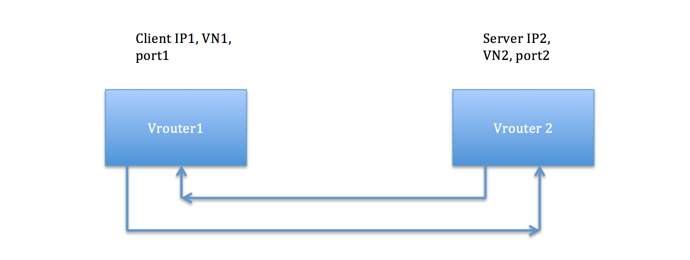

# 1. Introduction
We are evolving the Flow Collection infrastructure in Contrail to implement Security Policy, and to satisfy the requirements of EN-196, so it’s useful to consider some design goals and background for them.

# 2. Problem statement
The current collection focused on individual flows, which we are considering moving to bi-directional sessions instead, which consist of both the forward flow and the reverse flow. From a visibility and security standpoint, sessions are the right abstraction. From an implementation standpoint, it allows us to store half the number of records. We also have the opportunity to do better pre-aggregation at collection time, which can reduce the number of records even further, and make queries and stream processing easier and more efficient.
consider the use case below:

Consider the session shown here. There is client on vRouter1, which initiates a session to a server on vRouter2, which then responds. We identify this session according to the packet header from the first packet sent from the client to the server: CVN = VN1, CIP = IP1, CPort = p1, SVN = SN2, SIP = IP2, SPort = p2, Protocol = X. Both vRouters are able to use the same identity for the session based on the forward flow seen by them. But vRouter1 will record the client part of the session, whereas vRouter2 will record the server part.

Another usecase is detecting anomaly in the sessions. New config objects will be added, to indicate VMI's of interest along with anamoly detection algorithm. This can then be used to detect any abnormalities in session creation.

# 3. Proposed solution

We can always record traffic information for both the client and server part based on the 7-tuple, but some elements of this 7-tuple are more important for analysis than others. We need to design for more efficient queries for more important elements, and we can make less efficient queries for others. The maximum efficiency is gained by pre-aggregating when the information is recorded, so the number of records is reduced.  (e.g. for the sake of efficiency, we currently record InterVN stats explicitly by pre-aggregating across all elements of the 7-tuple except the VNs, even though we could have got the same information from flow records).

Notice that the CPort is usually not interesting for analysis (on both the Client part and the Server part), because it is an ephemeral port. In fact, when use fat-flows, it is always recorded as 0.  (by contrast, both Client and Server session parts find SPort very interesting, because it usually represents the service being offered or consumed – 80 in the case of HTTP). So, we can pre-aggregate by CPort.

Now let discuss the Client Part and the Server Part separately, starting with the Server part. The CIP and SIP fields are candidates for pre-aggregation also – they are less important than CVN/SVN. But there isn’t much to be gained on the Server part by pre-aggregating on a per Server-IP basis – a single vRouter will have a handful of Server-IPs anyway.

So, we pre-aggregate based on CIP and CPORT, and send information per combination of CVN-SVN-SIP-Protocol-SPORT.

This is what is needed for analyzing flows on the 7-tuple basis. But, we are also adding an enhanced security framework to manage connectivity between workloads (i.e. VMIs). Each VMI is “tagged” with the attributes of Deployment, App, Tier and Site. The user specifies security policies for VMIs in terms of values of these tags. We will need to analyze traffic flow between groups of VMI, where groups are categorized according to one or more values of these tags. These tags will also be communicated in routes, so that the vRouter has tag information about remote endpoints that it’s local VMIs are talking to. However, in the routes, these tags are IDs, not strings. When sending remote tags to analytics, vRouter agent should send names for tags in its own project and for global tags. Other tags may be sent as IDs.

To give us the ability to analyze traffic between these VMI groups, as well as security policies, as well as CVN-SVN-SIP-Protocol-SPORT, we are proposing that the current Flow message be replaced by a “SessionEndpoint” message. This message has these parts:

1.	The identity of the SessionEndpoint, which is a combination of:
    *	VMI. Given the local VMI, its tags and VNs are known too.
    *	Security Policy and Security Rule.
    *	Route attributes for the remote endpoint – tags and VN. For North-South routes and ECMP routes, we can use the route prefix as well.
2.	A SessionAggregate map, keyed by SIP-Protocol-SPort (for the Client part, it will be CIP-Protocol-SPort). The values in this map consist of the following:
    *	Session map, which contains the actual individual sessions for the aggregate, keyed by CPort and CIP. (for the Client part, it will be CPort and SIP). A given session can be marked as logged, sampled or both. The sampling works in similar was as the current Flow Sampling, but we need to do “Session Sampling” instead of “Flow Sampling”. For any given session, we need to either send both the forward-flow and reverse-flow, or send neither of them. The thresholding, upscaling and probability check actions can be based on either forward flow or reverse flow metrics, but the actions will need to be taken on both the flows.
    *	SessionAggregate counts - bytes/packets/flows. These counts should correspond exactly with the corresponding session map, and the sampled values in the session entries. Traffic analysis within and across Security Policies will use these session aggregate counts, instead of per-session counts.

As had been discussed, Session data can belong to either Sampled or Logged Flows. The destinations to which the SessionAggregates will be sent are configurable. Collector, local log and syslog are the different destinations that will be supported for the SessionAggregates

## 3.1 Alternatives considered

## 3.2 API schema changes

## 3.3 User workflow impact

## 3.4 UI changes

## 3.5 Notification impact

The FlowLogData that is being sent currently is going to be replaced by SessionEndpointData. Also an additional structure provide statistics about the security tags is also going to be provided. Here is a description of each of the structures.

    objectlog sandesh EndpointSecurityStats {
      1: string       name (key="ObjectVMITable")
     50: string       app
     51: string       tier
     52: string       site
     53: string       deployment
     54: string       vn
    
     // The key of this map is Security-Rule
      55: map<string, EndpointStats> eps (tags=”name,vn,app,tier,site,deployment,.__key”)
    }
    
    struct EndpointStats {
     10: list<SecurityPolicySessionStats> client (tags=””)
     11: list<SecurityPolicySessionStats> server (tags=””)
    }
    
    struct SecurityPolicySessionStats {
      1: string       remote_app_id
      2: string       remote_tier_id
      3: string       remote_site_id
      4: string       remote_deployment_id
      5: string       remote_prefix // use when app/tier/site/deployment is missing
      6: string       remote_vn
      7: u64 hits
      8: u64 tx_bytes;
      9: u64 rx_bytes;
     10: u64 tx_pkts;
     11: u64 rx_pkts;
    }

Next is the SessionEndpointData object reported by agent periodically:

    FlowLog SessionEndpoint {
        1: uuid_t vmi;
        2: string vn;
        3: optional string deployment;
        4: optional string tier;
        5: optional string application;
        6: optional string site;
        7: optional set<string> labels;
        8: optional string remote_deployment;
        9: optional string remote_tier;
       10: optional string remote_application;
       11: optional string remote_site;
       12: optional set<string> remote_labels;
       13: string remote_vn;
       14: bool is_client_session;
       15: bool is_si;
       16: optional string remote_prefix;
       17: ipaddr vrouter_ip;
       /**
        *  @display_name: key is local session end point defined as
        *  (protocol-port, ip address) and val is remote session end point
        */
       18: map<SessionIpPortProtocol, SessionAggInfo> sess_agg_info;
    };

    /**
    * @description:This structure contains a map of all the remote
    * session end points connected to this session. key uniquely
    * identifies the remote session end point and value is the
    * traffic info, security info, to that end point
    */
    struct SessionAggInfo {
    	1: optional i64 sampled_tx_bytes;
        2: optional i64 sampled_tx_pkts;
        3: optional i64 sampled_rx_bytes;
        4: optional i64 sampled_rx_pkts;
        5: optional i64 logged_tx_bytes;
        6: optional i64 logged_tx_pkts;
        7: optional i64 logged_rx_bytes;
        8: optional i64 logged_rx_pkts;
        9: map<SessionIpPort, Sessioninfo> sessionMap;
    };
    
    struct Sessioninfo {
        1: optional i64 sampled_tx_bytes;
        2: optional i64 sampled_tx_pkts;
        3: optional i64 sampled_rx_bytes;
        4: optional i64 sampled_rx_pkts;
        5: optional i64 logged_tx_bytes;
        6: optional i64 logged_tx_pkts;
        7: optional i64 logged_rx_bytes;
        8: optional i64 logged_rx_pkts;
        9: optional uuid_t forward_flow_uuid;
       10: optional uuid_t reverse_flow_uuid;
       11: optional i16 local_tcp_flags;
       12: optional i16 reverse_tcp_flags;
       13: optional string vm;
       14: optional i64 setup_time;
       15: optional i64 teardown_time;
       16: optional string action;
       17: optional string reverse_action;
       18: optional uuid_t sg_rule_uuid;
       19: optional uuid_t reverse_sg_rule_uuid;
       20: optional ipaddr other_vrouter_ip;
       21: optional uuid_t nw_ace_uuid;
       22: optional uuid_t reverse_nw_ace_uuid;
       23: optional u16 underlay_proto;
       24: optional u16 underlay_source_port;
       25: optional u16 reverse_underlay_source_port;
       26: optional string drop_reason;
       27: optional string reverse_drop_reason;
    } 

# 4. Implementation
## 4.1 Work items

### 4.1.1 Agent:
     The sampling algorithm used should not sample the session instead of the individual flow. The agent should also aggregate the sessions that belong to the same server port before sending it. The sandesh library in the agent should do a syslog of each of the sessions inside the aggregate message that are marked for security logging.
### 4.1.2 Analytics:
     New cassandra tables have to be created that can index the interesting fields in theSessionEndpointData message that it receives. Queryengine should also be modified so that data can be fetched with this new database schema.

# 5. Performance and scaling impact
## 5.1 API and control plane

## 5.2 Forwarding performance

# 6. Upgrade

# 7. Deprecations

# 8. Dependencies

# 9. Testing
## 9.1 Unit tests
## 9.2 Dev tests
## 9.3 System tests

# 10. Documentation Impact

# 11. References

