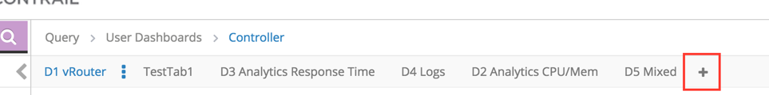
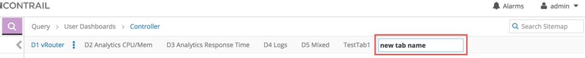
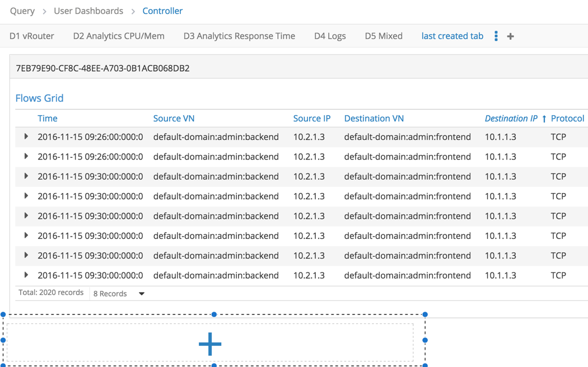
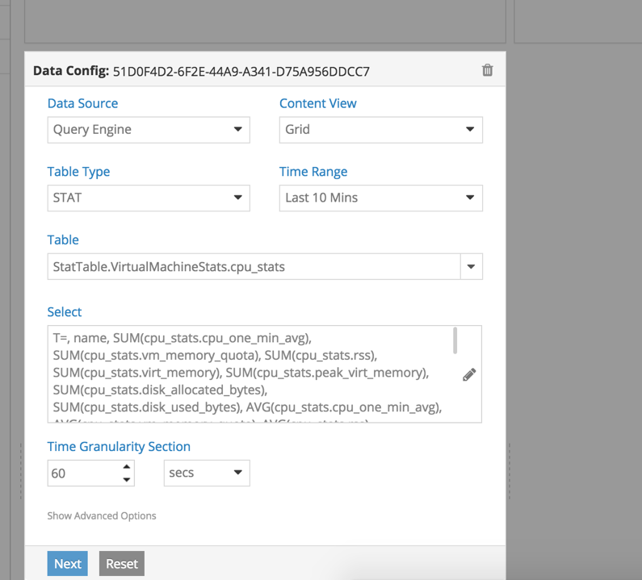
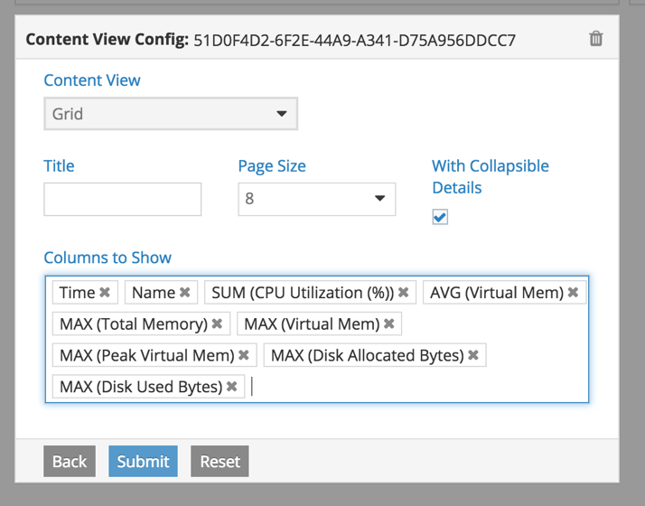
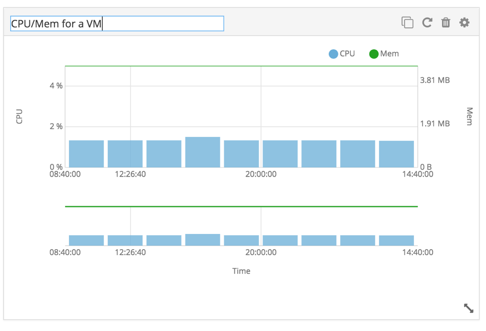
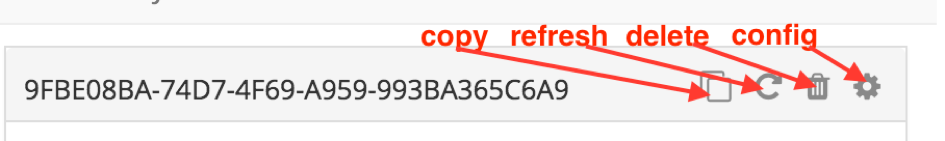

##1. Introduction
This blue print describes the design, features, and implementation of User-defined Dashboard (UDD) feature in Contrail Web UI.

##2. Problem Statement
User should be able to create and configure custom dashboards as per their requirement. 

##3. Proposed Solution
It is proposed to provide a new feature to create custom "User Dashboards" in UI. It shall allow users to create a new dashboard that comprises of tabs. User can create tabs and add widgets to these tabs under a dashboard. Each widget provides options to configure its look-and-feel and content that it displays. Users can create, edit, delete, rename, resize and move widgets within a tab. 

Each widget is proposed to have two type of configurations. 

**General Widget Configuration:** It allows users to define the look-and-feel of widget through configurations such as title, height, width, and placement.

**Widget Content Configuration:** It allows users to configure the content to be displayed within a widget.    

###3.1 Widget Content Configuration
UDD shall provide a default configuration option to configure the content of widget. This configuration option should be a backbone view that renders the form to be filled by user. This backbone view uses user input to render the content of widget.  

The default view to configure the content of widget contains two steps:

**Step 1**: It allows user to configure the data fetched from query-engine (QE) API. On select of data-configuration option, user is shown a form to build a QE query to be executed to fetch the data. In addition, it allows user to select a valid content-view option used to display the data fetched from QE API.  

**Step 2**: It allows user to specify additional configuration available for the content-view selected in Step 1. 

UDD by design should allow developers either to define new custom Backbone views or to extend exiting views for the configuration of widget. These custom views shall act as simple, custom, scalable means of configuring widgets to display content as required by users.   

###3.2 DB Schema Changes

UDD configurations are stored in config_webui keyspace of Cassandra. The user_widgets table that stores configurations is described below: 

```
CREATE TABLE config_webui.user_widgets (
    id uuid PRIMARY KEY,
    config frozen<config>,
    "contentConfig" map<text, frozen<widget_view>>,
    "dashboardId" text,
    "tabCreationTime" text,
    "tabId" text,
    "tabName" text,
    "userId" text
) WITH bloom_filter_fp_chance = 0.01
    AND caching = '{"keys":"ALL", "rows_per_partition":"NONE"}'
    AND comment = ''
    AND compaction = {'class': 'org.apache.cassandra.db.compaction.SizeTieredCompactionStrategy'}
    AND compression = {'sstable_compression': 'org.apache.cassandra.io.compress.LZ4Compressor'}
    AND dclocal_read_repair_chance = 0.1
    AND default_time_to_live = 0
    AND gc_grace_seconds = 864000
    AND max_index_interval = 2048
    AND memtable_flush_period_in_ms = 0
    AND min_index_interval = 128
    AND read_repair_chance = 0.0
    AND speculative_retry = '99.0PERCENTILE';
CREATE INDEX user_widgets_tabId_idx ON config_webui.user_widgets ("tabId");
CREATE INDEX user_widgets_userId_idx ON config_webui.user_widgets ("userId");
```
**dashboardId:** It is the unique id of a dashboard.

**tabId:** It is the unique id of tab under a dashboard.

**tabName:** It is the label used to display the name of tab in UI. 

**tabCreationTime:** It is a tab’s creation time.

**userId:** It is the username of user who created the widget. 

**config:** It is the configuration of a widget’s look-and-feel. A custom Cassandra data type stores a stringified JSON object which is enforced by a JSON schema **(Appendix A)**.

**contentConfig:** It is the configuration JSON of a widget’s content. A custom Cassandra data type stores a stringified JSON object which is enforced by a JSON schema **(Appendix B)**.   

###3.3 Static Configurations of UDD
There is a configuration file that describes the meta of UDD. It’s in JSON format with the name “default.config.json”. The JSON schema is provided in **Appendix C**.

###3.4 API Schema Changes
**N/A**

##4. Implementation

###4.1 Components

UDD implementation can be categorized into three components:  

1. **Contrail Web Server**

	Contrail Web Server will provide a REST API for client (browser) to add, edit, and delete UDD specific data in Cassandra.   

2. **Contrail Core Web UI**	

	UDD feature is common for all the plugins of Contrail Web UI. Thus it will implement through contrail-web-core repo. It will allow users to create UDD in any plugin of Contrail Web UI. 

	This common implementation provides users with default views to configure the content of widgets. Developer shall be able to create custom views in different plugin to cater to the specific requirement of plugin.    

3. **Controller, Server-Manager, and Storage Web UI**

	UDD can be enabled in any plugin through feature initialization. This initialization will not only load the core module of UDD but also load plugin-specific UDD view if any. 

###4.2 Workflow to create a user-defined dashboard 

####4.2.1 Create a new tab

* Click on “+” next to the last tab:

 

* Type in a name for the new tab and click anywhere outside the input box:

 
 
**Note:** With UDD (beta), users have to create at least one widget under the new tab to save the tab. Otherwise, the new tab will be lost the app is reloaded. In R4.0, the dependency on widget will be removed.

####4.2.2 Create a new widget:

* Click on “+” under the selected tab:

 
 
* Fill the forms properly for data source and visualization/content configuration and submit the configuration to save the new widget

 
 
 

####4.2.3 Customize a widget’s look-and-feel:

The widget’s position and size is adjustable by simple dragging on edges or title bar. To change widget’s title, simply click on the title and click outside of the input box after making the modification.

 
 
**Note:** changing title can be done any time. Adjusting position and size can only be done when the widget is not being configured.

####4.2.4 Operations on a widget:

* copy: make a copy of the widget under the same tab
* refresh: reload/re-render the visualization of the widget
* delete: delete the widget
* config: open the configuration forms of the widget

 

###4.3 Add a new dashboard link in sidebar

Update the app’s menu.xml by adding below snippet:

```
<item>
    <label>User Dashboards</label>
    <iconClass>menu-icon fa fa-dashboard</iconClass>
    <init>Path/to/the/loader/definition/file</init>
    <items>
        <item>
            <hash>unique_hash_string</hash>
            <label>UDDDispalyName</label>
            <loader>
                <class>UDDLoader</class>
            <loader>
            <searchStrings>User Dashboard</searchStrings>
        </item>
    </items>
</item>
```

###4.4 Work items

* Web-server side REST API for client to interact with Cassandra
* A common implementation of client-side UDD common to all plugins
* Enable UDD in all plugins (controller, storage, and server-manager) of Contrail WebUI
* Required enhancement of test-case framework (if any) 
* Unit, Acceptance, System, and Regression test-cases
* Create custom view to simplify the configuration of widget’s content 

##5. Performance and Scaling Impact

###5.1 Query Engine

All the UDD widget queries are made to Query Engine(QE). This section identifies the scope of performance and scaling impact on QE.

* Benchmarking
	* 	Identify basic set of widget configurations users most likely to configure and create a baseline combination of queries for each dashboard
	*  On a single node and multi-node Contrail setup, Test time to receive response from QE with single/multiple simultaneous query combinations
	*  Identify max number of simultaneous queries QE can handle and test the same with widgets under a tab
	*  Identify the impact of running multiple combination queries with large time period and query with large result set
	*  Identify backend API bottleneck and frame updated requirement to support future releases.
	
*  Identify backend API bottleneck and frame updated requirement to support future releases

##6. Upgrade

In R3.2, UDD (beta) improperly uses one Cassandra table to store all data. In R4.0, this single Cassandra table will be into three Cassandra tables to store UDD’s, tabs and widgets respectively. This requires mapping current records into the new tables and shouldn’t corrupt them.

Refactor the code base to break the strong connections between the Grid system, the widget and the sub-views (data config views, visual meta config views and the visualization views).

##7. Deprecations
**N/A**

##8. Dependencies

* Lodash@3.10.0
* jQuery@2.2.4
* Knockout@3.4.0
* Backbone@1.3.3
* Knockback@1.1.0
* Backbone.Validation@0.9.1
* GridStack@0.2.5


##9. Testing

Our current UI system testing infrastructure allows mocking a backend server and simulating user actions on UI components and asserting the required result. This section will introduce testing of UDD feature after required updates on current UT infrastructure is addressed.    
###9.1 Unit Testing

Basic unit testing of model and utility functions and make sure validation is properly ensured and other error/null cases are handled.
###9.2 Acceptance/Integration Testing 

Main integration points on UDD will be tested under this scope – QE, Chart API and backend database update.

* Update data config model with values and check serialized output conforms to QE input data model schema
* Update content config model with values and check serialized output conforms to chart API input config model schema
* After successful completion of a widget, confirm data sent to database config save option captures all the data required to recreate the widget.
###9.3 System Testing

Under this scope we will simulate various positive and negative user actions not limited to below mentioned tests on the UI and will mark the test success based on the expected result.
	
* Create a new widget, fill in valid data, config forms and test successful rendering of content view. Implement this for different content view with their respective config
* Mock the backend database schema of a widget config. Edit the loaded widget and assert the required changes.

##10. Limitations

This implementation has a limitation wherein users are not able to create new user-defined dashboard links in sidebar. In addition, there are only limited default views available to configure the content of a widget. More views are required for users to configure a variety of dashboards.  

##11. Documentation Impact

UI documentation needs to be updated to provide information on usage of UDD.

##Appendix A 

JSON schema of “config”:

```
{
  "type":"object",
  "title":"Root schema.",
  "description":"An object describes the complete configuration of a widget’s appearance.",
  "properties":{
    "title":{
      "type":"string",
      "title":"Title schema.",
      "description":"Title of a widget."
    },
    "x":{
      "type":"integer",
      "title":"X schema.",
      "description":"X coordinate value of a widget’s position in a grid system."
    },
    "y":{
      "type":"integer",
      "title":"Y schema.",
      "description":"Y coordinate value of a widget’s position in a grid system."
    },
    "width":{
      "type":"integer",
      "title":"Width schema.",
      "description":"Width of a widget."
    },
    "height":{
      "type":"integer",
      "title":"Height schema.",
      "description":"Height of a widget."
    }
  }
}
```

##Appendix B

**JSON schema of “contentConfig”:**

```
{
  "type":"object",
  "title":"Root schema.",
  "description":"An object describes the complete configuration of a widget’s subviews.",
  "properties":{
    "contentConfigView":{},
    "contentView":{},
    "dataConfigView":{}
  }
}
```

**contentConfigView:** 

```
{
  "type":"object",
  "title":"ContentConfigView schema.",
  "description":"An object describes the underlying info for this configured content config view.",
  "properties":{
    "view":{
      "type":"string",
      "title":"View schema.",
      "description":"Name of a Backbone view for the content config view"
    },
    "viewPathPrefix":{
      "type":"string",
      "title":"ViewPathPrefix schema.",
      "description":"Path to load the Backbone view."
    },
    "model":{
      "type":"string",
      "title":"Model schema.",
      "description":"Name of a Backbone model for the content config view."
    },
    "modelConfig":{
      "type":"string",
      "title":"ModelConfig schema.",
      "description":"A stringified JSON object describes the state of the configured Backbone model."
    },
    "modelPathPrefix":{
      "type":"string",
      "title":"ModelPathPrefix schema.",
      "description":"Path to load the Backbone model."
    }
  }
}
```

**contentView:**
 
```
{
  "type":"object",
  "title":"ContentView schema.",
  "description":"An object describes the underlying info for this configured content view.",
  "properties":{
    "view":{
      "type":"string",
      "title":"View schema.",
      "description":"Name of a Backbone view for the content view."
    },
    "viewPathPrefix":{
      "type":"string",
      "title":"ViewPathPrefix schema.",
      "description":"Path to load the Backbone view."
    },
    "model":{
      "type":"string",
      "title":"Model schema.",
      "description":"Name of a Backbone model for the content view."
    },
    "modelConfig":{
      "type":"string",
      "title":"ModelConfig schema.",
      "description":"A stringified JSON object describes the state of the configured Backbone model."
    },
    "modelPathPrefix":{
      "type":"string",
      "title":"ModelPathPrefix schema.",
      "description":"Path to load the Backbone model."
    }
  }
}
```
**dataConfigView:**

```
{
  "type":"object",
  "title":"DataConfigView schema.",
  "description":"An object describes the underlying info for this configured data config view.",
  "properties":{
    "view":{
      "type":"string",
      "title":"View schema.",
      "description":"Name of a Backbone view"
    },
    "viewPathPrefix":{
      "type":"string",
      "title":"ViewPathPrefix schema.",
      "description":"Path to load the Backbone view."
    },
    "model":{
      "type":"string",
      "title":"Model schema.",
      "description":"Name of a Backbone model for the data config view."
    },
    "modelConfig":{
      "type":"string",
      "title":"ModelConfig schema.",
      "description":"A stringified JSON object describes the state of the configured Backbone model."
    },
    "modelPathPrefix":{
      "type":"string",
      "title":"ModelPathPrefix schema.",
      "description":"Path to load the Backbone model."
    }
  }
}
```


##Appendix C

JSON schema (this is an example for describing the structure and all possible fields) of “default.config.json”:

```
{
  "type":"object",
  "title":"Root schema.",
  "description":"Meta data of UDD.",
  "properties":{
    "contentViews":{},
    "dataSources":{}
  }
}
```

**contentViews:**

```
{
  "type":"object",
  "title":"ContentViews schema.",
  "description":"An object describes available content subviews for a UDD widget. Each property of it uses the same name as the Backbone view’s file name.",
  "properties":{
    "GridView":{
      "type":"object",
      "title":"GridView schema.",
      "description":"Meta data of GridView view.",
      "properties":{
        "label":{
          "type":"string",
          "title":"Label schema.",
          "description":"The display name of GridView view."
        },
        "contentView":{
          "type":"object",
          "title":"ContentView schema.",
          "description": “Meta data of the content view.",
          "properties":{
            "view":{
              "type":"string",
              "title":"View schema.",
              "description":"Name of a Backbone view."
            },
            "viewPathPrefix":{
              "type":"string",
              "title":"ViewPathPrefix schema.",
              "description":"Path to load the Backbone view."
            }
          }
        },
        "contentConfigView":{
          "type":"object",
          "title":"ContentConfigView schema.",
          "description":"Meta data of the content config view.",
          "properties":{
            "view":{
              "type":"string",
              "title":"View schema.",
              "description":"Name of a Backbone view for GridView."
            },
            "viewPathPrefix":{
              "type":"string",
              "title":"ViewPathPrefix schema.",
              "description":"Path to load the Backbone view."
            },
            "model":{
              "type":"string",
              "title":"Model schema.",
              "description":"Name of a Backbone model for GridView."
            },
            "modelPathPrefix":{
              "type":"string",
              "title":"ModelPathPrefix schema.",
              "description":"Path to load the Backbone model."
            }
          }
        },
        "validations":{
          "type":"object",
          "title":"Validations schema.",
          "description":"An object describes the validation rules used by GridView when a user configs it with certain data source. Each property of it uses the same name as a data source Backbone view’s file name.",
          "properties":{
            "QueryConfigView":{
              "type":"object",
              "title":"QueryConfigView schema.",
              "description":"Validation ruleset applied to QueryConfigView. When no properties are defined, there’s no validation applied to the data source.",
              "properties":{

              }
            }
          }
        }
      }
    }
  }
}
```

**dataSources:**

```
{
  "type":"object",
  "title":"DataSources schema.",
  "description":"An object describes avaible data sources and their configuration subviews for a UDD widget. Each property of it uses the same name as the Backbone view’s file name.",
  "properties":{
    "QueryConfigView":{
      "type":"object",
      "title":"QueryConfigView schema.",
      "description":"Meta data of QueryConfigView view.",
      "properties":{
        "label":{
          "type":"string",
          "title":"Label schema.",
          "description":"The display name of QueryConfigView view."
        },
        "view":{
          "type":"string",
          "title":"View schema.",
          "description":"Name of a Backbone view for QueryConfigView."
        },
        "viewPathPrefix":{
          "type":"string",
          "title":"ViewPathPrefix schema.",
          "description":"Path to load the Backbone view."
        },
        "model":{
          "type":"string",
          "title":"Model schema.",
          "description":"Name of a Backbone model for QueryConfigView."
        },
        "modelPathPrefix":{
          "type":"string",
          "title":"ModelPathPrefix schema.",
          "description":"Path to load the Backbone model."
        },
        "modelConfig":{
          "type":"object",
          "title":"ModelConfig schema.",
          "description":"An object describes the initial/default state/setting of the Backbone model. Each property of it must be defined on the model first.",
          "properties":{
            "time_range":{
              "type":"integer",
              "title":"Time_range schema.",
              "description":"Value of a query’s time range"
            }
          }
        }
      }
    }
  }
}
```







